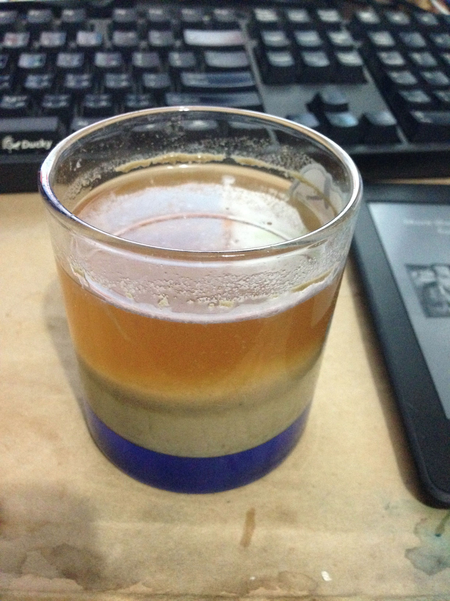

**150927啤酒醋**

味道意外的不錯ＸＤＤ 這個測試是在不封口（只倒扣一個碗）的情況下直接杯內發酵（9/21-9/27），前期還不差，很香，果蠅來了一堆，一週後就開始有醋味了...XD

變成醋推測是因為每兩天就開一次蓋，結果有隻果蠅掉進去了的關係，不然前期的釀造香還滿棒的。 做這個測試一方面是確認空氣中的乾淨程度，另一方面也想知道封口要做到多嚴格才不會感染，所以接下來還會測其他的封口方式

啤酒醋本身味道果香濃厚，乍聞之下還以為是梅子醋之類的東西，酸味大概也跟市面上的醋飲差不多。喝起來的口感可以感覺到穀物的厚度跟甜味，或許可以做成飲品試試
