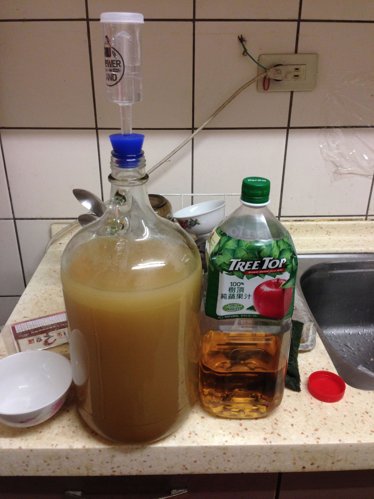

**150927蘋果酒**

TreeTop濃縮還原蘋果汁1.7瓶，Mauribrew Y514澳洲酵母3g，一大匙透明麥芽糖

因為天氣漸涼所以室溫一發，希望酵母的濁度不會影響到酒體本身

預定一發七天，二發20天

一發時間：17（150927-151013）

註解：一個多小時就開始冒泡惹，真愉快

室溫27度，發酵瓶表面溫度卻已經29度，有點太過劇烈了，還是乖乖丟回冰桶Orz

09/28: 改放冰塊，溫度大概在15-20

10/10: 小氣泡連續發到現在，受不了了，回到室溫一天看看，然後丟到冰箱去了

10/13: 準備二發，OG 1.00，果汁本身OG 1.048，補了大概700ml

喝起來有點小嗆，大概是糖分都吃光的關係。補一點果汁就順口很多，目前整體感覺還不差。

10/15: keg桶爆炸了QAQ 果然補糖還是要算過... 現在剩下不到一半Orz

1.下次還是普通的加糖好了...

2.下次東西放廁所，包緩衝材..

*   700ml 1.48果汁 約 84g 糖 ....5L 如果 2.5Vol 20度C 約需要 32.9g .... 84g for 5L 是多很多
*   目標 10L(加入的果汁量 也會成為 10L 的一部份 原發酵液＋果汁=10L),
*   C02 Vol 2.5 ? 溫度 20度C? 計算需要多少發酵糖量
**   要加的果汁糖度 ? 比重1.048, 約 糖度12 (100g約含12g糖) 
**   設目標 10L ,Vol 2.5 (27.6PSI), 發酵液溫度 20度Ｃ
*   需 65.8g (可上 Brewersfriend 網站計算)
*   用 比重1.048, 約 糖度12 果汁 ...65.8/12 * 100g = 約需果汁 548.3g

10/17: bambio跟朋友分享，很適合搭配甜點的清爽佐餐酒，評價不差，但sean表示酸酸的不喜歡

keg有個問題：出酒時噴力太猛，出來的泡沫很綿密，但是很快就消光光，也不會再生泡沫
