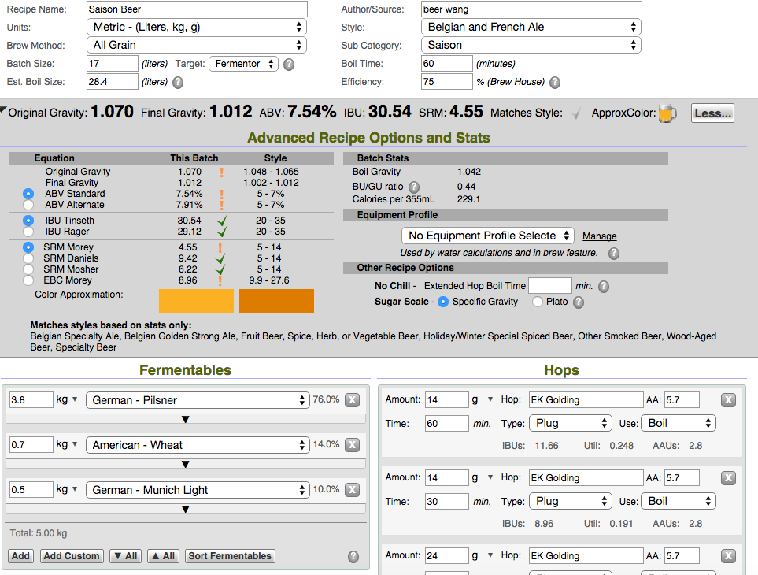

**151030啤酒王Saison Beer 比利時鄉村啤酒套餐 Ethen**

麥芽：

3.8 kg Pilsen malt 德國皮爾森麥芽

0.7 kg Wheat  美國小麥芽

0.5 kg Munich  德國慕尼黑麥芽

0.5 kg 蜂蜜

水21升

煮沸20分

EK Golding 0.5oz 60 min 14克煮沸60分

EK Golding  0.5oz 30 min 14克煮沸30分

EK Golding  0.8oz 15 min 24克煮沸15分＊２５，下冷卻管

酵母Danstar Belle Saison 11克 擴培45分

糖化時間：1:40

一番搾：大陸食品級塑膠桶30升，實際產出約16升，但酒譜說是19升囧 

一發前比重1.07突破天際，應該是蜂蜜的關係

一發溫度：17-20 [http://www.danstaryeast.com/company/products/belle-saison-beer-yeast](http://www.danstaryeast.com/company/products/belle-saison-beer-yeast)

一發時間：（10/30-）

註記：大概是老蜂蜜的關係，超難融化在底下積成一攤，最後只好連渣一起混混進去

老蜂蜜沈澱了不少結晶，用溫水化了半天。查了一下似乎是葡萄糖結晶，應該沒有問題

因為發酵筒口小，使用管子注酒沒辦法打到氧氣，希望最後搖蜂蜜那段有把氧氣充足

漏了量比重，逆向撈回來好麻煩，下次要留意

這次煮太久了了了了.....水也不夠時間也不夠...

是說轉換效率有夠低啊啊啊，果然還是該買糖化桶了嗎？還是先做離心機？

11/4這隻酵母很活躍，冒泡與香味都不錯

11/16 還在冒泡...

151125 裝瓶，FG 1.004，味道....考北怎麼我覺得有種又鹹又甜的重口味感.... 不喜歡

151219 本來前面開的幾隻老是狂噴或是酸味，今天開了一隻感覺圓潤許多，好像漸漸進入狀況了

160110 終於穩定，得到的評價基本上是一隻重口味的啤酒，鹹味圓潤

