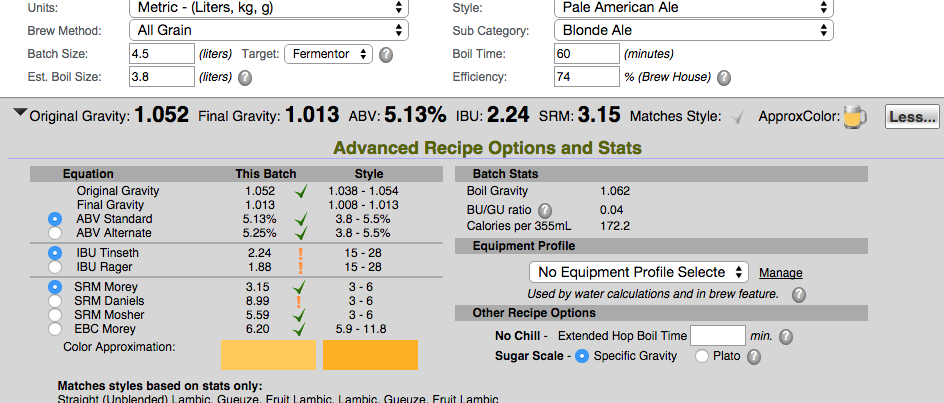

**151107柚子啤酒 Ethen**

麥芽：比爾森1kg

酒花：Hallertau苦花3g 4.5% 30分下，美國Cascade香花1g 6.7% 10分下 柚子皮3分下

酵母514 reuse

水5升，煮完約4.5升，冷凝固物0.5升，最終成品不到4L

OG 1.052, 不管是熱凝固物還是冷凝固物都很多，吃掉了1L左右

本來計畫是切碎乾燥柚子皮泡米酒，但泡出來的液體有點苦，看了討論才知道白色不能入，因此改成放棄苦花，香花少放點，但實際加下去感覺也沒很苦，所以又把柚子皮放下去煮，並最後加入少量消毒過的無白色柚子皮。

下次試試削新鮮柚子皮

151115裝瓶，FG 1.016

反應不佳，說是有壞掉的感覺 Q_____Q

151129 蛙表示苦味太黏，決定放棄

