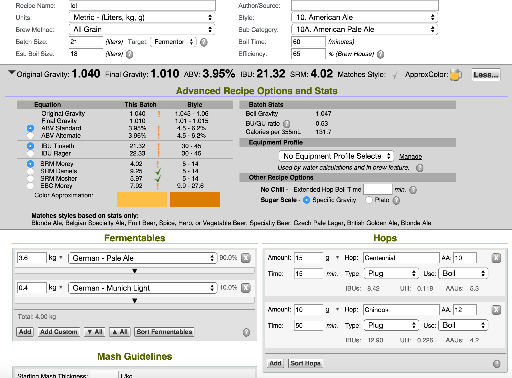

**151115 神秘ale Sean**

麥芽：紐西蘭ale 3.6kg，慕尼黑0.4kg

酒花：Centennial苦花15g 10.5% 45分下，Chinook香花5g 12% 10分下

酵母：陽光大道reuse

OG 1.03

第一次使用Star Sam

151106早上 酵母沒反應 G_G  週三回到家再決定是否補酵母

151119 發酵過於緩慢，加入reuse 514酵母清澈部分

151123 加入3g S-04酵母，量測比重1.02，看起來不是沒發酵，而是桶子氣密性不佳QAQ 莫名有種小麥味....

151125 裝瓶，FG 1.014

