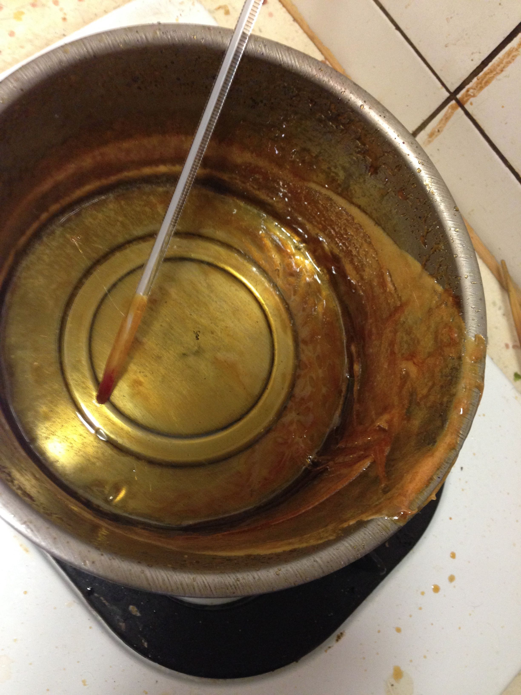

**160209 Candy Sugar Ethen**

1.煮的時候會起大量泡沫，至少兩倍高，請準備夠大的鍋子跟玻璃容器

2.都是泡沫所以無法靠顏色判斷溫度，請準備高溫溫度計

3.色彩跟對應表似乎不大一致，或許是因為用二砂的關係？溫度量到165但是色彩感覺像132

4.相當粘鍋，夠濃稠，所以直接倒入瓶中就好，別用漏斗會黏得一塌糊塗

嚐起來很焦糖，沒有太多特別的味道，沒有苦味，大概是138的形容

融解了一部分為1.045的水溶液下S-04發酵看看，放置一天沒有反應

凝固後整個變成膏狀囧，相當難以取出，看來下次補充水量得放到237ml才夠，瓶子得找大一點

