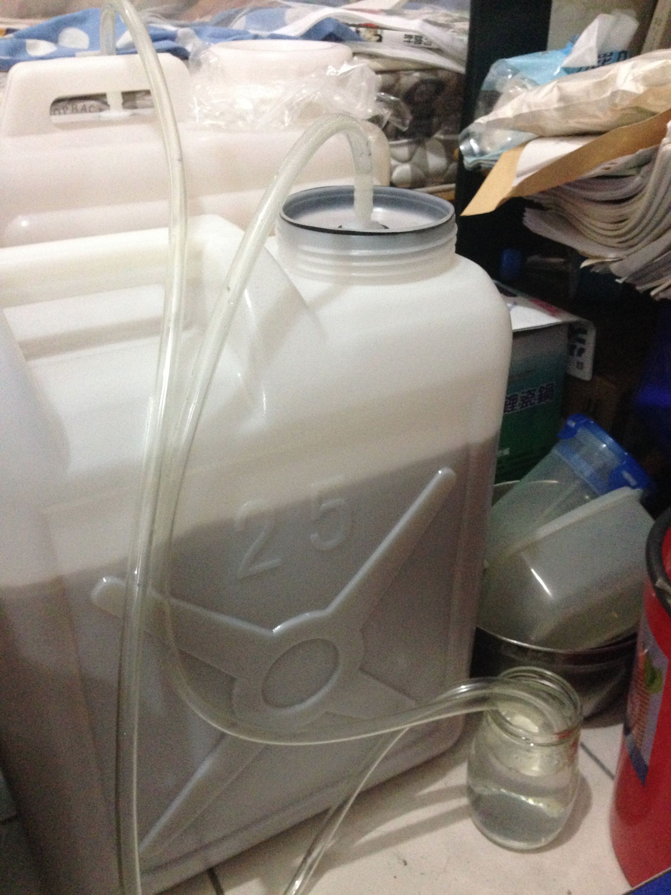

**160211 Coppers Stout Ethen**

[http://store.coopers.com.au/stout-1-7kg.html](http://store.coopers.com.au/stout-1-7kg.html)

20L水、1kg二砂、酵母包裝時間05515

最終產出約21L

前天晚上燒好水放涼，但因為多階段糖化測試爆了，下午又要測GrainFather導致臨時需要鍋子，只好連忙把這個一起煮了。麥芽精極黑，酵母活動一個晚上就進入高泡期，現在正在房間中大量製造二氧化碳Orz

管子排放二氧化碳的部分，氣密還是最大的問題，用了保鮮膜跟一堆塑膠袋總算搞定了，現在乖乖的嘓蟈蟈，簡直就像睡在水池旁邊Orz

160221 裝瓶 FG 1.007 喝起來超水，這哪門子Stout Orz

但是苦味很強烈，我想可能還是得自己加入燕麥之類增加厚度

