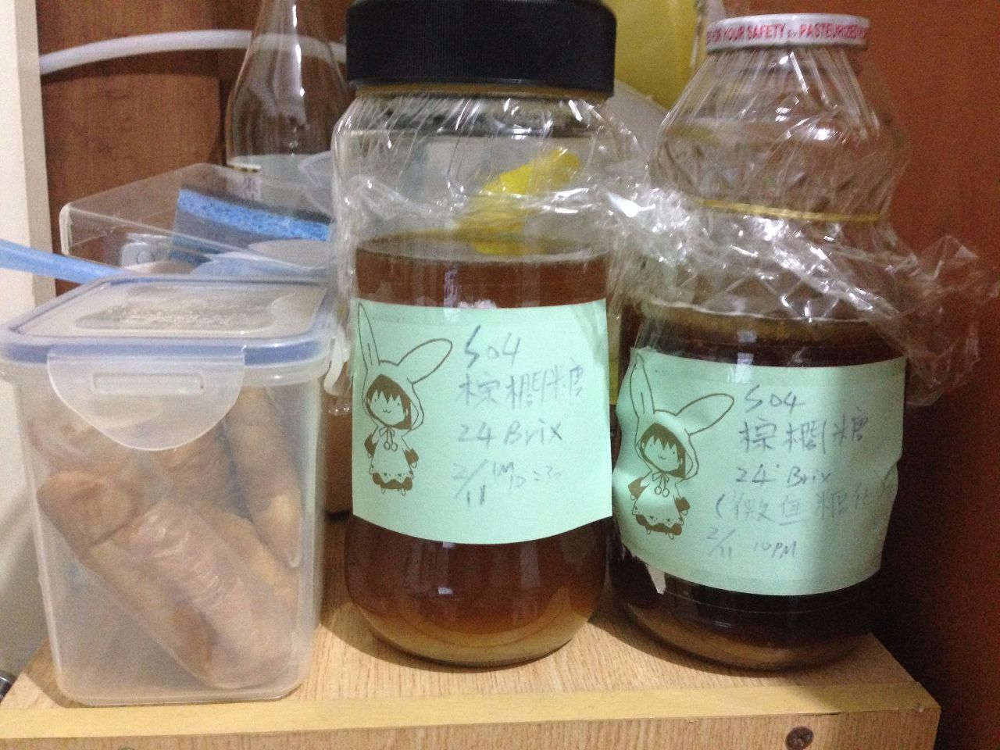

**160211 棕櫚糖測試 阿索**

棕櫚糖調成24brix煮沸後裝瓶，加入酵母S-04

160219 都還在冒泡。因為裝瓶時似乎有掉果蠅下去，所以可能會失敗

160226 雖然還沒發酵完，不過也試試看。有明顯的甜味、核果香氣，跟lager混飲很棒，香氣有留下來，很值得一試，可以做更多進一步實驗。剩餘的量持續放置發酵中

160317 完全發酵，圓潤的堅果味，棕梠味也可以嚐到一些，感覺的出來很烈，但是又醇厚有深度，很有中國陶罐酒的風格

