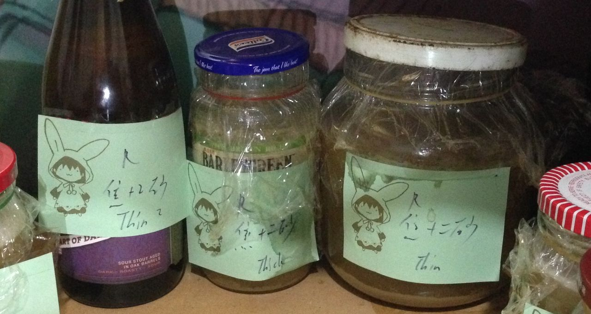
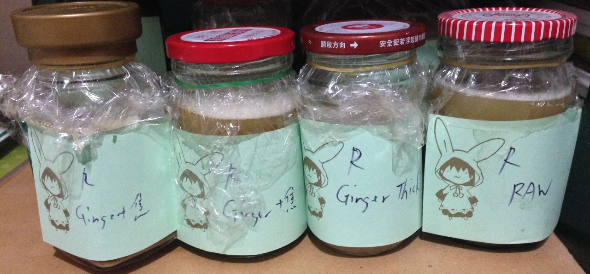
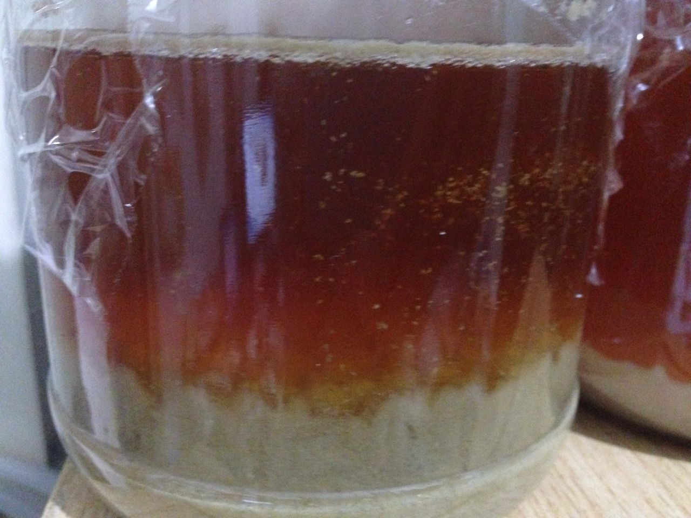

**160212 麥渣回收測試**

從14:00開始燉煮麥渣，溫度提高到90度關火等待，看看晚上有沒有糖分被析出

昨天放到現在的麥渣已經有一些味道跑出來了，不過還沒壞掉

據洺呈表示會有麥殼析出的單寧苦味

保溫8小時後，取得1.01x左右的麥汁，經過長時間煮沸濃縮到1.036。沒有顯著的苦味，但是有種紙的味道，猜測是前面雜菌發酵跟麥殼的味道混合的結果。

把前面一批的酒花丟下去煮，一起濃縮，結果爆炸苦Orz 或許是一般酒譜是為了取香味，所以才沒有煮太久，留下了不少alpha酸

分裝了六份測試組，酵母S-04

*   爆炸苦原汁
*   爆炸苦+大量薑糖蜜
*   爆炸苦+大量薑糖蜜+焦糖稀釋
*   爆炸苦+焦糖+二砂 濃
*   爆炸苦+焦糖+二砂 淡

順便也回收了上一批爆炸的多階段糖化超濃底渣，本來想試試看大量底渣的發酵效果，不過中途還是忍不住濾了。現在是大量細渣，發酵中。

160219 其他試驗都還在冒泡。超濃底渣發酵差不多了，但是出現一堆懸浮物，讓我有點怕啊囧

160226 全部都喝了。底渣有股水味，但大致上是啤酒沒錯

回收系列苦味整個消不掉，薑糖有薑汁啤酒的感覺，candy sugar有明確的增加酒體甜度與厚度的效果，兩者搭配效果不錯。下次試試看跟一般大麥啤酒的搭配

