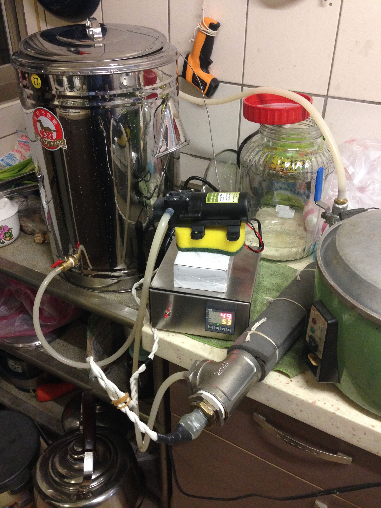
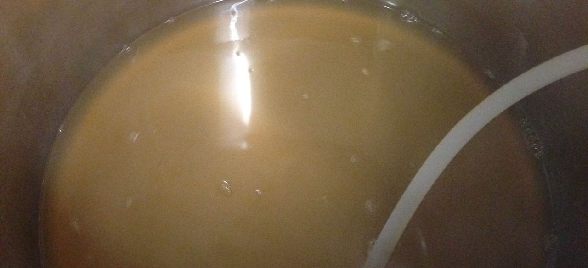
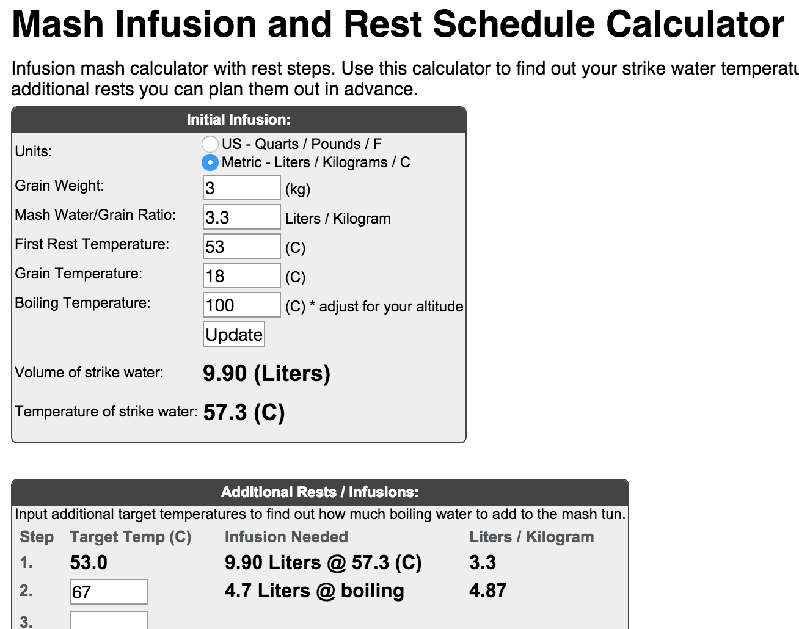
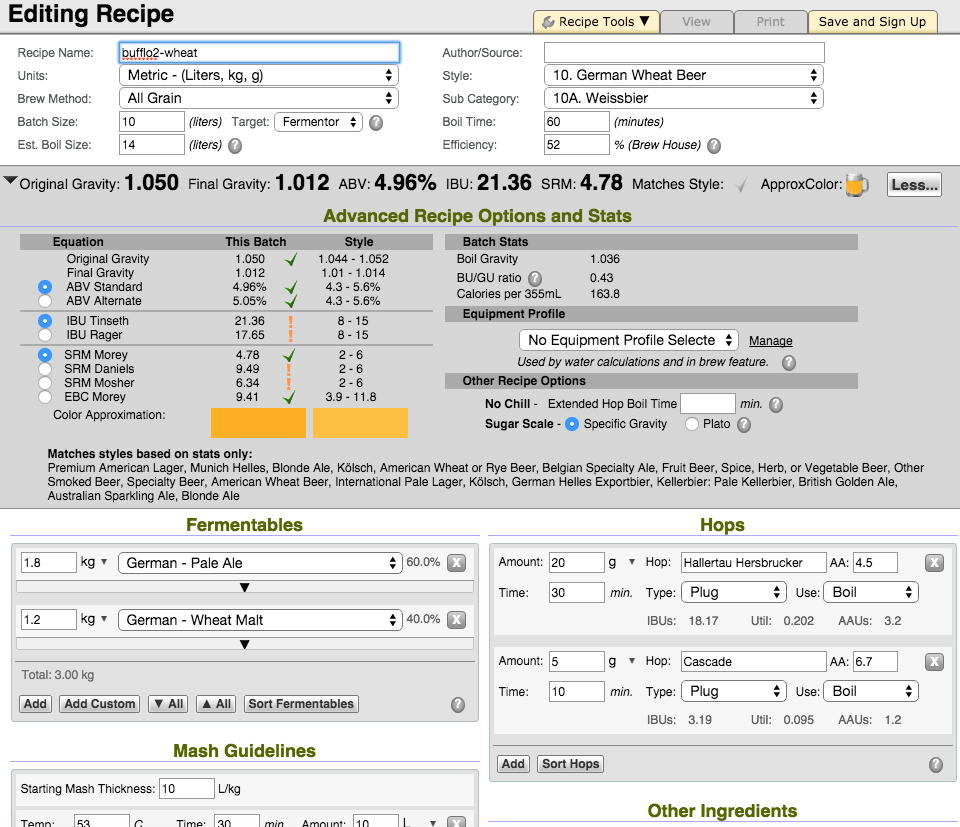

**160225 多階段糖化設備測試 啤酒王小麥 Ethen**

希望這次不會堵住了Q__Q

設備資訊：[多階段糖化與設備改裝](多階段糖化與設備改裝.md)

啤酒王小麥的譜

*   German pale ale 1.8kg
*   German Wheat 1.2kg
*   Hallertau 20g 4.5% last 30min
*   Cascade 5g 6.7% last 10min
*   酵母S-04 2.5g 舊麥汁擴培1hr

糖化效率超低Orz 52%甚至以下

糖化階段：

*   初始10L 50度拉升到53度 30min
*   加入5L沸水 拉升到67度 30min

加熱器採用間斷啟動，補足溫度到目標溫度即停止加熱與循環

*   一番搾 11L OG 1.04 煮完OG 1.05
*   二番 2L OG 1.03（另開一鍋煮到OG 1.04，使用回收酒花）
*   糖化鍋底渣一杯未使用

糖化結束後麥殼過濾層效果很棒，出來的麥汁很清澈，也未曾有任何堵塞

關於蛋白質休止，效果相當的好，煮沸階段出現大量的蛋白質熱渣，就像煮大量肉類火鍋的湯渣一樣，撈得要死Orz 或許可以期待這鍋會有相當綿密與厚度的口感

160318 終於裝瓶Orz, 酵母味滿重的，放太久了。氣味不知道為啥有點貓糧的感覺，口感甜又有點厚度，小麥的感受普通，記號3X，FG 1.012

兩週後試飲，酵母味淡多了，貓糧味也消失了

