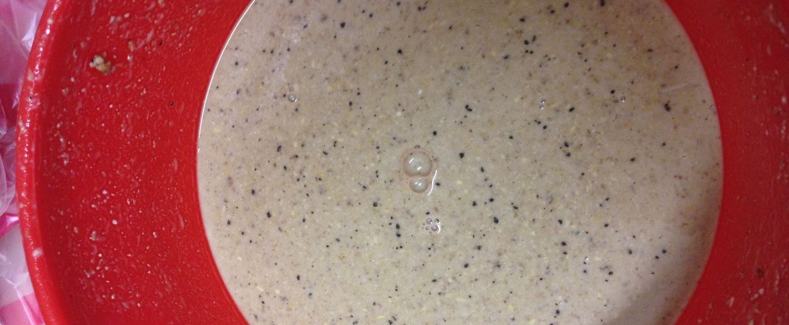

**160305 金鼎軒黑麥汁 Ethen**

*   pilson大麥芽
*   Caramel Light Malt
*   黑麥芽
*   Hallertau 3g

因為他沒有提供每個階段的溫度，只好照譜來

*   5L 37度投料 30min
*   5L 52度沖入 45min
*   5L 76度沖入 10min
*   煮沸50min
*   下酒花10min
*   沈澱30min後裝瓶，約3-4天後口感佳

如需氣泡，需做強制充氣

OG 1.02, 超低，有點不爽，另外加500g糖到1.04

清理糖化桶時發現底部有厚厚一層澱粉，碘液測試深藍

本來以為是糖化失敗，酵素不足，但是收集澱粉加入新打碎的麥芽糖化一小時亦無反應，所以可能是其他的東西

因為有多階段糖化，煮出來的蛋白渣很多很多，口感就差了

無法發酵天然充氣也是個問題

下次還是做大一點的批量，強制冷卻加上槽內靜置沈澱來得好

溫度計算
<table style="font-size:13px;cell-spacing: 0px; border-collapse: collapse;"><tr><td style="border:1px solid #999; min-width: 50px;height: 22px;line-height: 16px;padding: 0 4px 0 4px;" class="added">Step</td>
<td style="border:1px solid #999; min-width: 50px;height: 22px;line-height: 16px;padding: 0 4px 0 4px;" class="added">Target Temp</td>
<td style="border:1px solid #999; min-width: 50px;height: 22px;line-height: 16px;padding: 0 4px 0 4px;" class="added">Infusion Needed</td>
<td style="border:1px solid #999; min-width: 50px;height: 22px;line-height: 16px;padding: 0 4px 0 4px;" class="added">Liters / Kilogram</td>
</tr>
<tr><td style="border:1px solid #999; min-width: 50px;height: 22px;line-height: 16px;padding: 0 4px 0 4px;" class="added">1.</td>
<td style="border:1px solid #999; min-width: 50px;height: 22px;line-height: 16px;padding: 0 4px 0 4px;" class="added">34.5</td>
<td style="border:1px solid #999; min-width: 50px;height: 22px;line-height: 16px;padding: 0 4px 0 4px;" class="added">5.00 Liters @ 36.9 (C)</td>
<td style="border:1px solid #999; min-width: 50px;height: 22px;line-height: 16px;padding: 0 4px 0 4px;" class="added">2.50</td>
</tr>
<tr><td style="border:1px solid #999; min-width: 50px;height: 22px;line-height: 16px;padding: 0 4px 0 4px;" class="added">2.</td>
<td style="border:1px solid #999; min-width: 50px;height: 22px;line-height: 16px;padding: 0 4px 0 4px;" class="added">44.5</td>
<td style="border:1px solid #999; min-width: 50px;height: 22px;line-height: 16px;padding: 0 4px 0 4px;" class="added">5.00 Liters @ 52 (C)</td>
<td style="border:1px solid #999; min-width: 50px;height: 22px;line-height: 16px;padding: 0 4px 0 4px;" class="added"></td>
</tr>
<tr><td style="border:1px solid #999; min-width: 50px;height: 22px;line-height: 16px;padding: 0 4px 0 4px;" class="added">3.</td>
<td style="border:1px solid #999; min-width: 50px;height: 22px;line-height: 16px;padding: 0 4px 0 4px;" class="added">55</td>
<td style="border:1px solid #999; min-width: 50px;height: 22px;line-height: 16px;padding: 0 4px 0 4px;" class="added">5.00 Liters @ 76 (C)</td>
<td style="border:1px solid #999; min-width: 50px;height: 22px;line-height: 16px;padding: 0 4px 0 4px;" class="added"></td>
</tr>
</table>

160308 發現mini keg的塞子有膨脹現象，差點又炸了QAQ  巴氏消毒中

看了其他人的譜，單階段糖化溫度52，也是怪怪的

巴殺把mini keg炸了囧。但是巴殺之後的黑麥汁出現彷彿蜂蜜般的香甜氣息，或許是一個有趣的方向？

