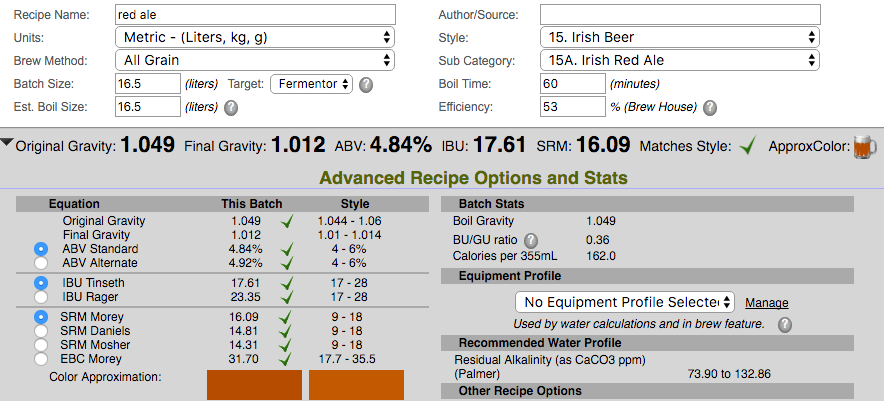

**160424 Irish red ale 啤酒王 Ethen**

酒譜 Irish Red OG1.058/ FG1.016 (5 Gal)

麥芽:

3500克 - Pilsen malt

1000克- Red X malt

130克 - Roasted Barley 烤大麥

270克 - Melanoidin Malt 美拉德麥芽

啤酒花 25克 - E.K. Goldings (60 min.)

酵母: 法國 Fementis S-04 啤酒酵母 2.5克

水15L -> 13L FG1.052

洗槽 3L -> 2L FG 1.041

洗槽 3L -> 2.5L FG 1.027-> 1.5L FG 1.04

FG 1.049

洗設備洗到4:45....總時間花費7小時囧

11:30檢視，沒有氣泡，但是已經有芒果乾香，另投入5.2g S-04增強

160501換桶，表面上有一點油花的感覺讓我有點擔心...

160517裝瓶，FG1.013

顏色超黑，高級醇味道不少，需要更長時間陳放

經過三個月，碘味絲毫沒有消失，Ｇ＿＿＿Ｇ

由於在相同一批看起來被感染的大麥啤酒中有聞到相同的碘味（沒試喝），初步斷定為感染

雖然討論中有人提到氯太重也會造成藥水味，不過目前暫時無法重現

### 問題整理

*   GF本身溫升功能沒有作用，是設定問題還是改F->C時壞掉了，跟[arvin](https://www.facebook.com/arvin.wang)確認中

    *   已確認是設定F to C時發生錯誤，改回F再改回C後就可以突破了，等待這週測試
    *   測試ok

*   手動控制等待時間太久，恐怕還是要有一個自製控制器，控制泵浦跟溫升才能真的把時間解放出來
*   泵浦過濾器到煮花完之後連續堵住兩次，第一次推估是酒花沒套袋的問題，第二次則是熱渣。堵住的主體都是麥芽渣，然後隙縫被酒花或熱渣填滿

    *   發現似乎速度緩慢主要是來自於熱交換器，而且5/1兩次都沒有遇到堵塞

*   洗槽是必要的，最多洗兩次，可以提升近10%糖化效率
*   煮花需套袋，不然酒體會很濁，又容易塞
*   熱渣的問題還在考慮，是不是要放棄蛋白休止，不確定自己喜不喜歡蛋白休止的效果，但熱渣很討厭
*   糖化效率差是一個很囧的問題，即便兩次洗槽洗出52%，也還是遠低於期望的60-70%。究竟是因為麥渣層過濾造成酒體潔淨導致比重下降，還是其他原因，尚待調查
*   這次的麥渣正在發酵中囧囧囧，看起來真的是糖化不完全，下次先試著調整料水比，並且增加攪拌率好了

### 下次測試

*   有無使用過濾層（糖化效率）

    *   最後10分再做就好

*   增加水量，增加攪拌率，只在mash out階段製造過濾層
*   有無使用多階段糖化（蛋白休止）
*   GF底層套豆漿袋（堵渣）

[其他人的糖化效率建議](../糖化效率建議.md)

