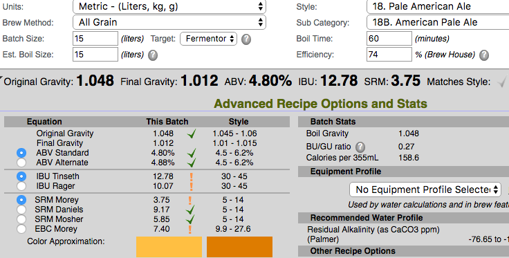
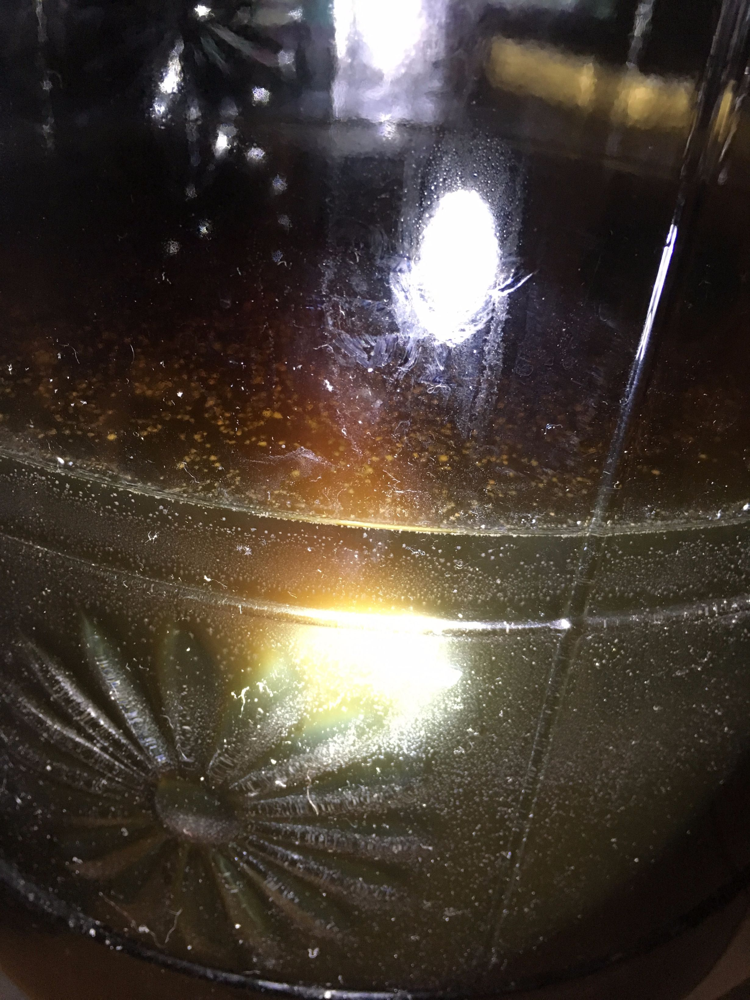

**160501 啤酒王大麥啤酒 Ethen**

Pale ale malt 3kg

16L水

單階段糖化溫度67度，GrainFather，60min+

初榨濃度 1.048

二榨 1.036 約3L

<s>三 1.029 </s>

洗槽 2 次

這次嘗試做成幾乎沒酒花的大麥酒，酒花拿 英國北方棕色啤酒 過水10min

最終產出 15L

OG 1.048

酵母S-04 4.2g

160507 換桶。比重1.007有點太低，但看似還沒發酵完，穀類的香甜味重，因為是桶底的關係所以有點塑膠或酵母味

酒體表面被小白點覆蓋，初步判定為霉菌感染，散發出一股碘味，估計是保鮮膜效力不佳所致

由於相近時間之

[160424-ethen-啤酒王IrishRedAle](160424-ethen-啤酒王IrishRedAle.md)

[160501-ethen-啤酒王英國北方棕色啤酒](160501-ethen-啤酒王英國北方棕色啤酒.md)

都發生碘味，懷疑可能跟此有關

