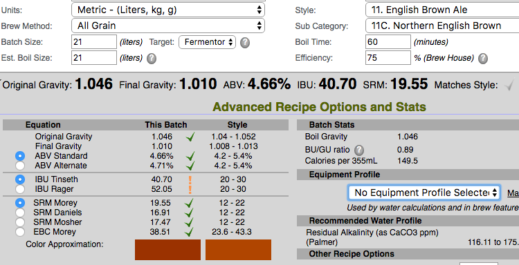

**160501 啤酒王英國北方棕色啤酒 Ethen**

Pale ale malt 3.6kg

Biscuit malt 100g

Special B malt 100g

Chocolate malt 100g

Black malt 100g

17L水

單階段糖化67度，GrainFather，60min+

初榨濃度 1.05

洗槽三次

Chinook 25g 14% 60min

EK Golding 25g 5.7% 1min

最終產出21L

OG 1.046

酵母Nottingham 11g

這次嘗試用GF糖化，抽出來鍋子煮花，再回GF冷卻

入桶時這樣會缺少氧氣，所以有刻意把管子拉高一點

結果入桶時發生悲劇，GF麥渣槽拉桿掉進已經冷卻且下了一半酵母的發酵桶囧囧囧

緊急把手消毒，撈起來然後酵母全下，希望能夠靠數量取勝，希望不會爆炸

但至少可以確定這批不能放久了Orz

目前發酵反應不錯，但是不知道為什麼有一種紅茶還是仙草的感覺，囧囧的

160507 換桶

160517 裝瓶 FG1.007

顏色超黑，高級醇味道不少，需要更長時間陳放

總裝瓶時間七小時，算起來一瓶花三分鐘，說真的大概也已經是目前動作速度的極限了

*   下次還是要分配一部分裝keg桶，比較省時間

這次第一次使用裝瓶桶，裝起來比直接虹吸出酒管好控制，但是也還是沒有到非常好用。

直接把糖拌進去這一點挺方便的

另一方面，玻璃的二發容器可以直接觀察頂上的氣泡來判定發酵程度

*   這次要記得在所有容器上面畫上刻度，下次就可以先煮糖了，不用先倒出來量
*   可能要準備一個專門的裝瓶桶，免去底下倒不出來的窘境，容量也夠大
*   下次接一條矽膠管在龍頭上，應該會更好控制

經過三個月，碘味絲毫沒有消失，Ｇ＿＿＿Ｇ

由於在相同一批看起來被感染的大麥啤酒中有聞到相同的碘味（沒試喝），初步斷定為感染

雖然討論中有人提到氯太重也會造成藥水味，不過目前暫時無法重現
