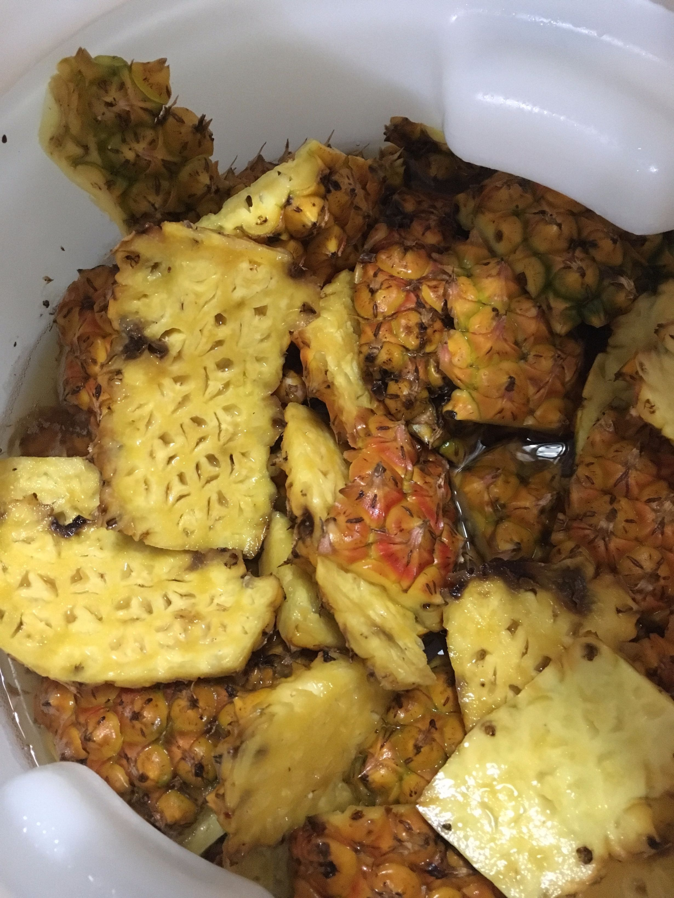

**160705 天然野生酵母鳳梨蒸餾酒 Ethen**
<undefined><li>**材料**</li></undefined>

總量120kg綠冠有機鳳梨 次級品（果實較小）

約產出50%的皮，40%果肉，10%葉子等廢棄物

皮釀酒，果肉冷凍後慢慢使用
<undefined><li>**流程**</li></undefined>

鳳梨去頭去尾，頭尾丟棄（據說尾可以留）

圓弧狀把果皮切下後，不清洗直接入發酵桶，裝約2/3桶（25L桶）

（不使用果肉，但也不刻意避開。果肉另做他用，果醬跟派！）

熬煮糖漿（水：糖重量1:1）8L水＋8kg二砂煮沸確保融化，降溫至40度以下後倒入發酵桶

糖漿盡量蓋過果皮，但實際會因為果皮會浮起所以不用刻意要求

桶口覆蓋保鮮膜後，放置室溫發酵

由於裡面會有不少野生菌，也有甲醇疑慮，因此等待一個月發酵後會進行蒸餾

加入糖水後一兩個小時水封就開始排氣了，第二天液面出現泡沫。

第二天補充過一次糖水，一桶約補3L的量，最終約20L

約5天後未被液體蓋住的果皮上出現白色點狀菌落

160713續上，兩種測試

1.將鳳梨皮切細，玻璃甕裝，約21L

2.不切細，啤酒王桶裝，約13L

都是沒幾個小時就澎起來了，相當活潑

160714

3.切細煮沸，加入160713-2發酵的上層酵母（倒了約1L汁下去），約26L

八小時後開始膨脹有細小氣泡

