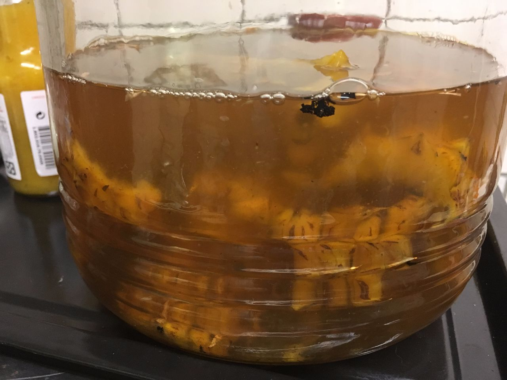
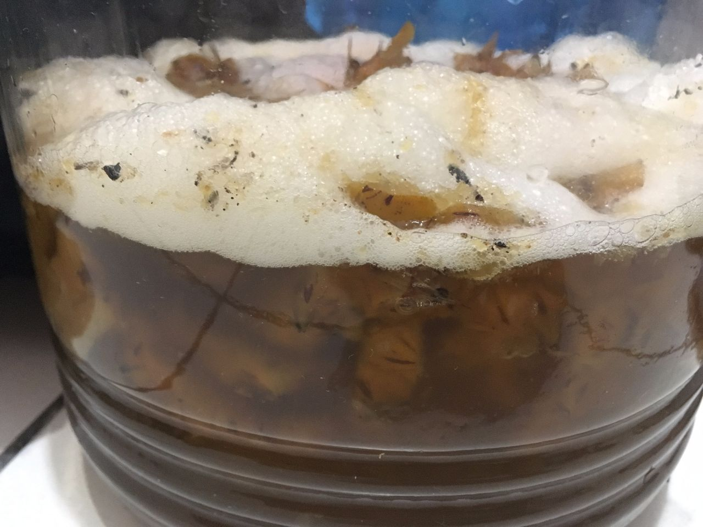

**160708 啤酒酵母鳳梨酒 Ethen**

同上，不過比照啤酒做法，器具皆消毒

果皮連帶糖漿一起煮沸後自然放涼，可以看到果皮的汁液更加徹底釋放

使用啤酒酵母S-04，常溫發酵

這次批量約3L

三個小時就有少量氣泡，經過一個晚上氣泡相當猛烈

（事實上本來8/5就煮了，但放置冷卻忘記下酵母，過了三天水面有飄一點菌絲，只好重新煮沸）

品嚐，大概是高級醇的味道較多，不是很討喜，放了幾個月沒改善，後來蒸餾掉了
