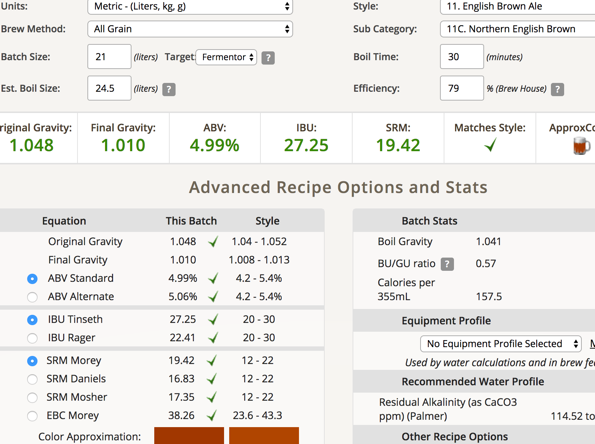

## ethen 英國北方棕艾爾第二次挑戰

**麥**

* Pale ale 3600g
* Biscuit 100g
* SpecialB 100g
* Chocolate malt 100g
* Black malt 100g

total 4kg

**酒花**

* EK Golding 4.8% 25g 5min
* Chinook 12% 20g 30min（原本是25g 60min, 但苦味值會高達43.55, 所以調降）

**酵母**
 
* Nottingham 11.5g

目標OG1.048 FG1.01 20L ABV4.98

**流程**

* 6:32 開始糖化，設定64度，初始水量16L
* 酵母暴走，估計應該損失了10%，臨時換到大桶繼續喚醒，感染率++
* 7:23 升溫68度
* 7:45 拉起麥汁開始升溫
* 8:06 洗槽
* 這次糖化效率似乎滿讚的，86%
* 9:26 終於沸騰了QAQ 煮花開始
* 9:52 下香花
* 9:58 殺菌降溫、入桶發酵
* 11:00 殺青收工，剩下大件沒洗

OG 1.048，產量21L

這批煙燻味較重，期待成果