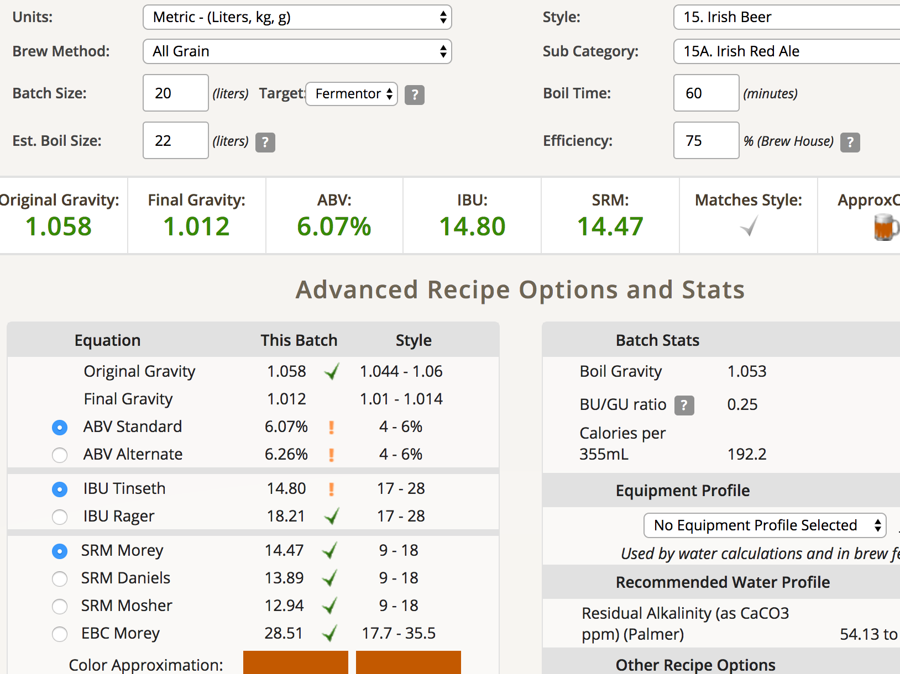

## sean 紅艾爾第三批挑戰

**麥**

* Pale ale 3500g
* Red X 1000g
* Melanoidin 270g
* ROASTED Barely 130g

total 4.9kg

**酒花**

* EK Golding 4.8% 25g 60min

**酵母**
 
* Nottingham 11.5g

目標OG1.058:FG1.012，預估ABV:6.07

**流程**

* 1:06 開始糖化，設定64度，初始水量15L
* 2:00 升溫71度
* 2:30 洗槽
* 3:50 煮花
* 4:50 處理突發的螺絲卡住事件跟一堆雜事，過濾麥渣並重新煮沸
* 5:25 冷卻，入桶發酵

OG 1.055，產量約20L

sean表示上一批RA可以加強烤麥芽味，這代表下次我們可以做客製化的譜了，強化ROASTED Barely