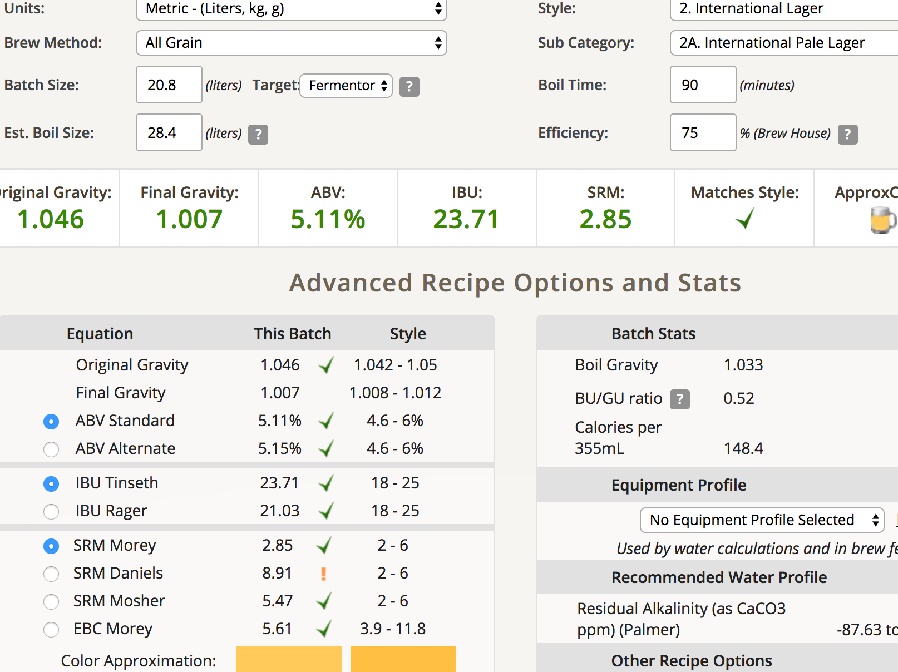
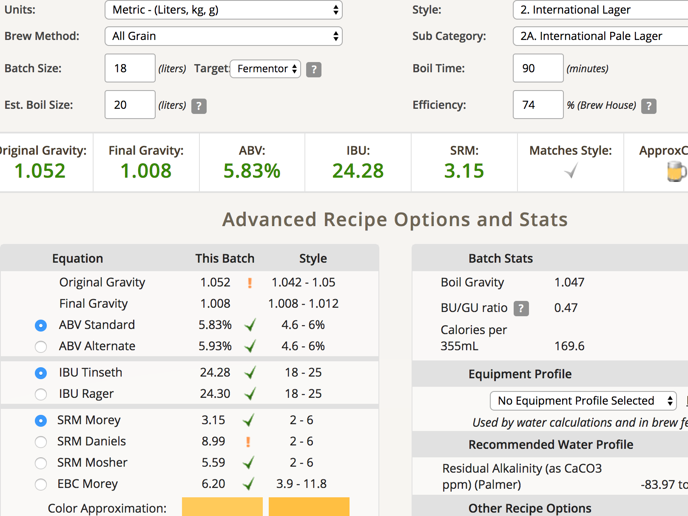

## 170209-Ethen-啤酒王Lager

第一次挑戰拉格

**發酵溫度**

大致上來說Lager會有三個階段

* 主發酵約10-15度 約兩週
* D-rest 拉高至18左右
* 熟成 0-4度 約兩個月

[美國saflager w-34/70的實驗](http://brulosophy.com/2016/02/08/fermentation-temperature-pt-4-lager-yeast-saflager-3470-exbeeriment-results/) 

* 華氏50度（10c）：3天進入高泡期，一週後約發酵一半，放回室溫，兩週發酵完成（意思是沒有完全低溫發酵）
* 華氏70度（19c）：36hr進入高泡期，一週接近發酵完成
* 最終具有相同的FG, 相同的澄澈度
* 找了一票人來品飲，無法分出差異

啤酒王的建議: 14度發酵，10度熟成，不過田大相當不以為然

**配方**

* 4kg pilson melt
* 50g Hallertau alpha 5.6% (減少為20g(60min)+20g(15min))
* 11.5g saflager w-34/70 
http://www.murphyandson.co.uk/Datasheets/Yeast%20-%20Saflager%20W-3470%20Yeast.pdf

預定OG 1.046 FG 1.007 ABV 5.11% IBU 23.71 產量20L

啤酒王建議煮花 20g 60min, 10g 30min, 20g 15min, 但這樣IBU會超過30不太match, 所以略作修改

**流程**

* 9:50 糖化開始 65度
* 酵母用白麥汁喚醒中
* 10:50 糖化69度
* 11:10 開始煮沸、洗槽
* 12:11 沸騰下苦花
* 撈不完的渣....
* 12:56 香花15min
* 1:11 冷卻
* 全部搞定又三點了Orz

實際OG 1.052 ABV 5.83 IBU 24.28 產量18L FG1.008

小看了蒸發量Orz 我該不該把剩下的麥汁煮沸加水去補呢？

發酵溫度10-13，兩週（2/24）

五個小時，酵母沒什麼反應，三天後高泡，跟美國saflager w-34/70的實驗一致

2/26 過了2.5週，估計主發酵應該結束了，溫度降至熟成溫度0-4

3/13 昨天酒譜設計課程Edwing Yang(長陸野酒廠釀酒師)建議先裝瓶碳酸化完再熟成，所以就裝瓶了，順便嚐味道，結果....QQ 各種DMS啊啊啊，果然大滾1.5hr不能省.... 不過喝起來還ok，甜度略高就是

FG 1.007-8，喝起來清爽，微甜，大致上跟氣味是搭配的Orz 使用2.5vol碳酸化

170408: 雖然整體來說這支酒0度熟成只有一個半月，其他時間雖然低溫但都在15度左右，但氣味與酒體整體來說都是很不錯的。柱哥表示“不說這支酒的種類，大家都會覺得很棒”

另，DMS放一段時間之後也漸漸隱沒在酒體的甜味之中了，感覺不太到，我猜可能跟略高溫的熟成有點關係？