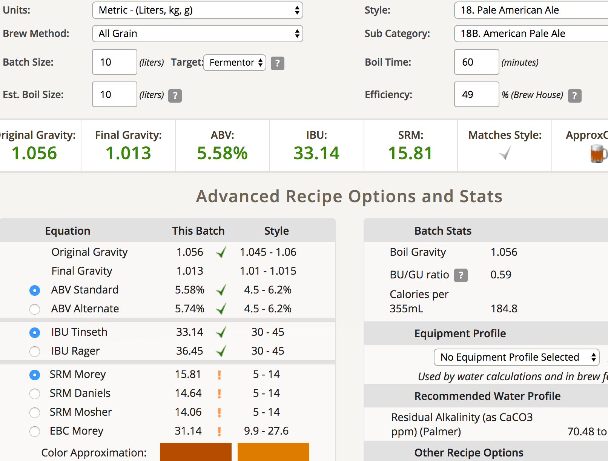

# 170220-ethen-陽光大道

麥

* Pale ale
* Crystal 120L
* Wheat

total 3.6kg

計算機使用推估比例 65/7/27

酒花

* Cascade 6.9% 15g 5min (原譜20g 5min)
* Centennial 8.9% 15g 40min (原譜20g 30min)

酵母

* S-04 11.5g

流程

* 9:00 開始糖化 設定66度(偏甜)
* 9:05 喚醒
* 10:15 洗槽

這次麥的狀況似乎不太好，醣化完1.052，洗槽後10L 1.046，糖化效率約40%，大概只能做10L了，可能是碾麥的關係，所以洗槽非常順利。雖然調整了啤酒花，不過色度還是偏深。

S-04這次喚醒的效果不是很顯著，沒有明顯泡沫，會不會是用大瓶子的關係？

* 10:30 沸騰
* 10:42 苦花
* 11:17 過濾
* 11:25 香花
* 11:30 消毒 冷卻

呃，煮花結束 10L OG 1.056是哪招.... 雖然中間是有補洗槽水補到10L啦，但哪來多這麼多？

10L OG 1.056 糖化效率49%  
預測 FG 1.013 ABV 5.58% IBU 33.14

這次熱循環消毒CFC沒有做的很徹底，約96度循環五分鐘就開始冷卻了，是比較不足的地方。但要足夠溫度在跑又會拖很多時間，怕影響苦味，下次應該要把過濾的部分再提前才好

這次過濾後沖回GF內突然爆發出一堆熱渣，這也很詭異...過濾的時候都沒出來，怎麼衝回去就冒出來了

酒花好像可以再煮久點，渣的香氣很濃

