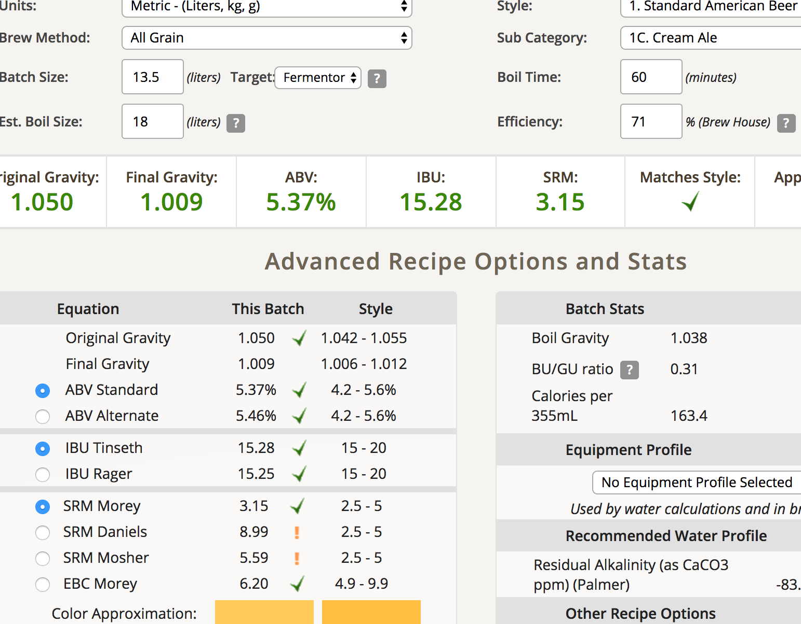

# 170225-sola-假大麥真CreamAle

**麥**

* German Pilsner 3kg

**酒花**

* 苦花：Tettnanger 2.9% 20g 60min 靠啤酒王又給錯...
* 香花：Cascade 8.1% 5g 10min

**酵母**

* US-05

**流程**

糖化約90min，溫度67度，操作時間，18:35-22:30  
水15升加熱至70度，放入GF後維持67度糖化1.5小時  
糖化時每隔一段時間就去手動攪攪，有時用幫浦打10分鐘循環。  
糖化完後加入3升冷開水洗糖  
酵母 U-5 有喚醒酵母近5小時

麥汁13公升  比重 1.050  
試喝時發現極甜，沒啥苦味。  

產量13.5L OG 1.05 預估FG1.009 ABV5.37 IBU15.28 

這是阿索第一次完全自助用GF完成的酒，大賀！應該要做酒標來貼（？

由於苦花太弱，所以預估成果會偏甜。我比較擔心的是酒精度可能會比較明顯，因為沒有苦味去壓制

做完才發現這隻類似[Cream Ale](https://en.wikipedia.org/wiki/Cream_ale)，然後有人做跟我們很像的[譜](http://www.brewersfriend.com/homebrew/recipe/view/237555/awesome-recipe)。如果成果不錯那我們就用這樣來釀Cream ale好了ＸＤ
