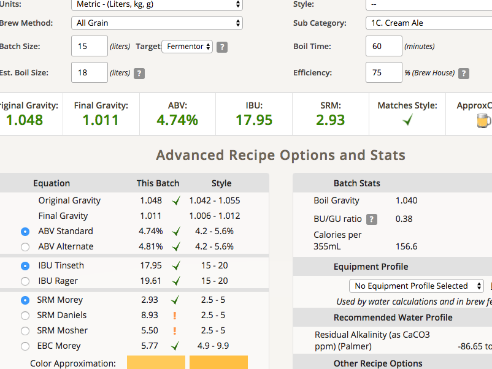

# 170304-ethen-大麥可樂桶發酵測試

本次測試主要是測試可樂桶是否適合做為發酵桶

同時也測試可樂桶降溫與Pipe line式釀造

**麥**

* German Pilsner 3kg

**酒花**

* 苦花：Hallterau 4.5% 20g 60min
* 香花：Cascade 6.7% 5g 5min

**酵母**

* S-04 11.5g 啟動

預估 OG 1.048 FG 1.011 ABV 4.74 IBU 17.58

**流程**

* 11:10 糖化67度 12L初始水量
* 12:10 過濾移動到大鍋煮沸，同時洗糖
* 12:30 沸騰
* 01:00 苦花
* 01:55 香花
* 02:00 入可樂桶
* 02:30 可樂桶丟去冷水桶冷卻，同時清掃
* 04:00 估計降溫花的時間半小時

實際 OG 1.048 FG 1.011 ABV 4.74 IBU 17.95

下次要確認一下可樂桶的實際容量，假設是18L的話，我估計這次的產量大約是15-16L

確實有一點加速效果：
GF專注糖化、瓦斯煮花速度比較快、冷卻可射後不理、最後一批可以先清洗GF節省時間，這樣算起來一個批次3.5hr

keg發酵還有個優點，水封的聲音小多了(出管口比較細)

