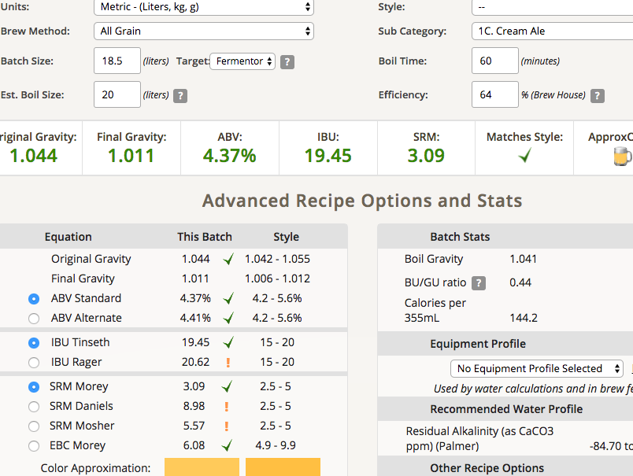

# 170304-sola-大麥WTF

練手、消耗老酒花、測試老酒花的問題、測試磁石攪拌子

據說老酒花會有臭腳味....(抖)

**麥**

* German Pilsner 4kg

**酒花**

* 苦花：Hallterau 4.5% 12g 60min（放了一年多）
* 苦花：Chinook 12% 5g 60min（放了一年多）
* 香花：Cascade 6.7% 10g 5min（放了一年多）

**酵母**

* S-04 5g 啟動（放了半年）

預估 OG 1.044 FG 1.011 ABV 4.37 IBU 19.45

**流程**

* 17:40 糖化67度 20L初始水量，1.5HR
* 19:55 苦花
* 20:45 香花，不小心打翻進了煮鍋

結束1.052 15L太高，另外加入沸水3.5L

實際 OG 1.044 FG 1.011 ABV 4.37 IBU 19.45

乾乾乾最後還是忘記整個倒下去，結果攪拌子進了發酵桶，裝瓶完得提醒自己要撈回來

酵母倒下去忘記搖勻，結果腦包用了75%去衝散...如果酵母沒掛的話真的是運氣好。下次臨時沒無菌水應該用米酒的..

3/21 裝瓶，FG 1.008，聞起來發酵味有點強，喝起來還算清爽。CO2設定為2.5, 看結果了

發酵時間拉得有點長，看起來擴培的效果沒有很明顯，下次拉長時間看看