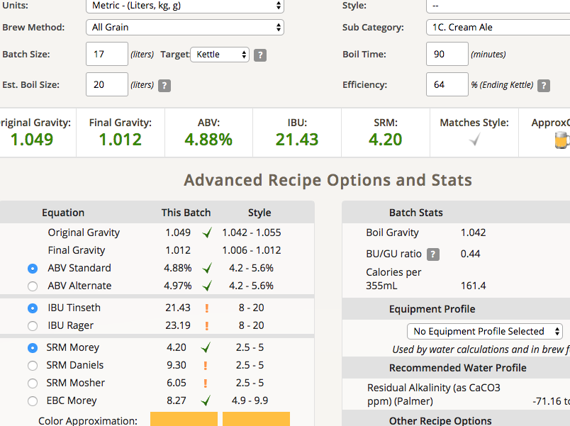

# 170401-Sean-CreamAle

**麥**

* 紐西蘭pale ale 4kg

**酒花**

最後一批的新鮮酒花ＱＱ

* 苦花：Tettnanger 2.9% 20g 60min
* 苦花：Chinook 12% 5g 60min
* 香花：Cascade 7% 5g 5min

**酵母**

* S-04 660cc擴培20hr

**流程**

GF糖化 64度 60min

碾麥碾得比較細，但糖化效率反而變低了 64%

鍋子煮花

目標產量17L 1.05 1.01 5.16% 38.15 SRM 6.99

因為糖化效率低了不少，所以改成煮沸排水，但也因此苦花煮的久很多，苦味高於預期Orz

一天連續三個批次，好累Orz 不過時間又進一步縮短了，12點開始，12點含清潔收工，受賜於有人幫忙所以可以同步糖化，如果有好的合作夥伴可以進一步縮短時間

但代價是太過忙碌所以有一些東西沒辦法有餘力去顧，例如比重資訊量到的速度太慢導致來不及對低糖化效率做出反應

該多買些可樂桶了...

產量16.5L OG 1.44 預估FG1.009 ABV4.54 IBU42.21 SRM7.14

170423裝瓶

沒什麼香氣，口感微妙，有點麥芽但感覺很怪...Orz

170502 試飲，酵母味....Orzzzzzz