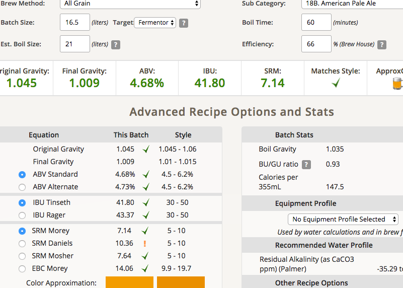

# 170401-Sola-過期酒花APA

**麥**

* 紐西蘭pale ale 3.2kg
* Crystal light (估計40L) 0.3kg

**酒花**

* 苦花：Centennial 8.2% 25g 60min
* 香花：Cascade 6.7% 25g 5min

**酵母**

* Nottingham 660cc擴培20hr

**流程**

GF糖化 64度 60min

碾麥碾得比較細，但糖化效率反而變低了 66% 大概是碾的人的問題（誤

鍋子煮花

目標產量17L 1.05 1.01 5.16% 38.15 SRM 6.99

因為糖化效率低了不少，所以大火煮沸把水煮掉些，最後ABV還是高了點

產量16.5L OG 1.45 預估FG1.009 ABV4.68 IBU41.8 SRM7.14

170423裝瓶

FG 1.012 果味豐富，略苦的APA。看起來比重差有點多