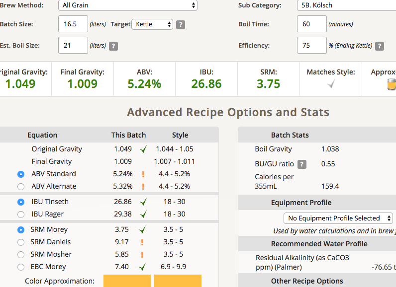

# 170401-Ethen-過期酒花科隆

**麥**

* 紐西蘭pale ale 3.3kg

**酒花**

* 苦花：Magnum 12.1% 13g 60min
* 香花：Saaz 3.7% 30g 5min 阿靠，本來想要0秒投入，忘記了Orz 苦味應該會高於預期

**酵母**

* US-05 660cc迴旋擴培20hr

**流程**

GF糖化67度 60min

碾麥碾得比較粗，初估75%糖化效率，不過用手揉碎還是有碘液反應，等一下碾細一點看看。因為碾的效果不錯，所以洗槽時非常的順利。

鍋子煮花，有趣的是這次的熱渣一下就被吃回去了，沒得撈

煮過頭，補水2L，不過看起來這次的酒精度還是偏高

目標產量17L 1.047 1.009 5.09% 26.07 SRM 3.68

產量16.5L OG 1.49 預估FG1.009 ABV5.24 IBU26.86 SRM3.75

發酵溫度 15，這次不用管封用保鮮膜
 

