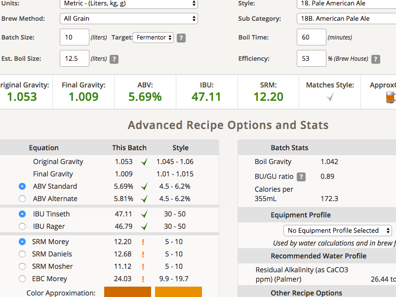

## 170414-Ethen-pico_pale_ale

第一次使用Pico

**配方**

Pico Pale Ale(APA)

* 2.91kg American Pale ale melt
* 0.34kg American Crystal 60L
* Magnum 6g 13.5% 60min
* Perle 11g 8.9% 15min
* cascade 10g 6.2% 10min
* cascade 31g 6.2% 5g
* water 13.51L
* 11.5g safale US-05

預定OG 1.053 FG 1.007 ABV 6% IBU 40 SRM 12 

**流程**

* 11點開工
* 醣化66.7度90min
* 煮沸60min / Magnum
* -15min Perle
* -10min cascade
* -5min cascade
* colddown with bucket
* 3點半完工
* 清潔結束4:19

OG 1.06 8.75L，糖化效率53%

麥汁比預期的少了不少，濃度有點高，應該可以補水個1.25L=> 1.053/1.009 5.69% 47.11 12.2
