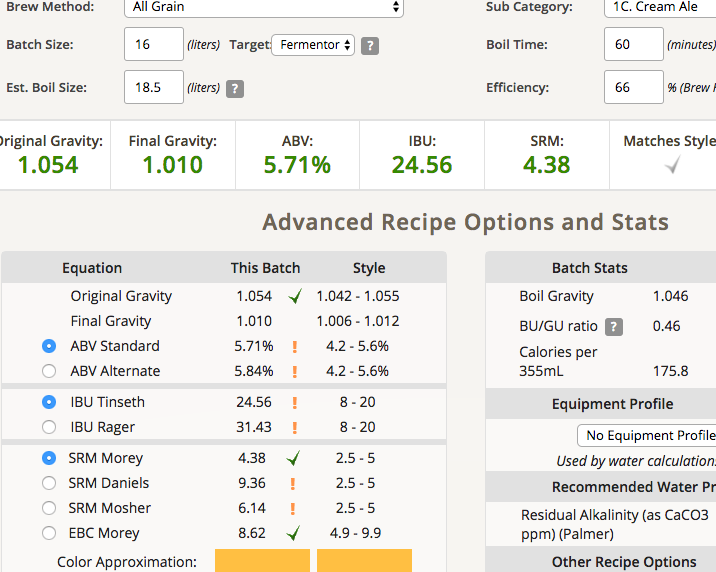

# 170424-Ethen-CreamAle

**設備**

Pico 

**麥**

* 紐西蘭pale ale 4kg

**酒花**

* 苦花：Hallterau 3.2% 11g 60min
* 苦花：Magnum 12% 10g 60min
* 香花：Cascade 7% 5g 5min

**酵母**

* US-05 直接使用前一批科隆酵母泥

**流程**

糖化 67度 90min

碾麥使用一張信用卡寬 66%，高於預期的好

需要一隻好的磅秤

FG 1.054....好高啊，產量目測約15L，不知道有什麼可以量keg桶內比較準的方法.. 重量！

空桶4.4kg, 裝好20.4kg, 所以裡面有16L，可能要扣掉1L的酵母，比PICO推測的14L多一點點

甜度不錯，苦味略高，苦花放太多了

可樂桶測試ok, 這次的改裝效果不錯，可以買桶子了

目標產量14L 1.0455 1.091 5.16% 19 SRM 4

產量16L OG 1.054 預估FG1.01 ABV5.71 IBU24.56 SRM4.38

後來看了一下麥渣量，很有可能我量錯麥芽了，所以糖化效率估計錯誤Orz 不過至少苦味也拉高了，我猜應該是平衡的