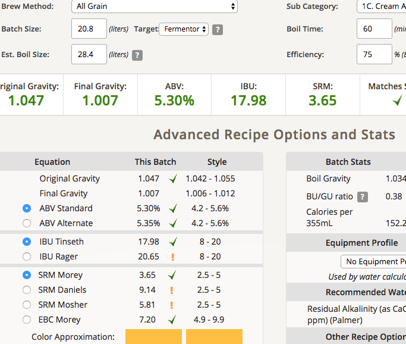
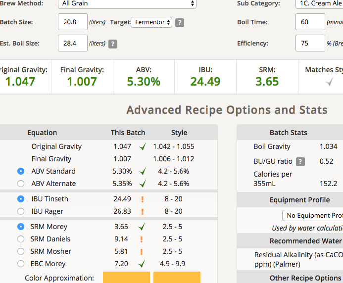
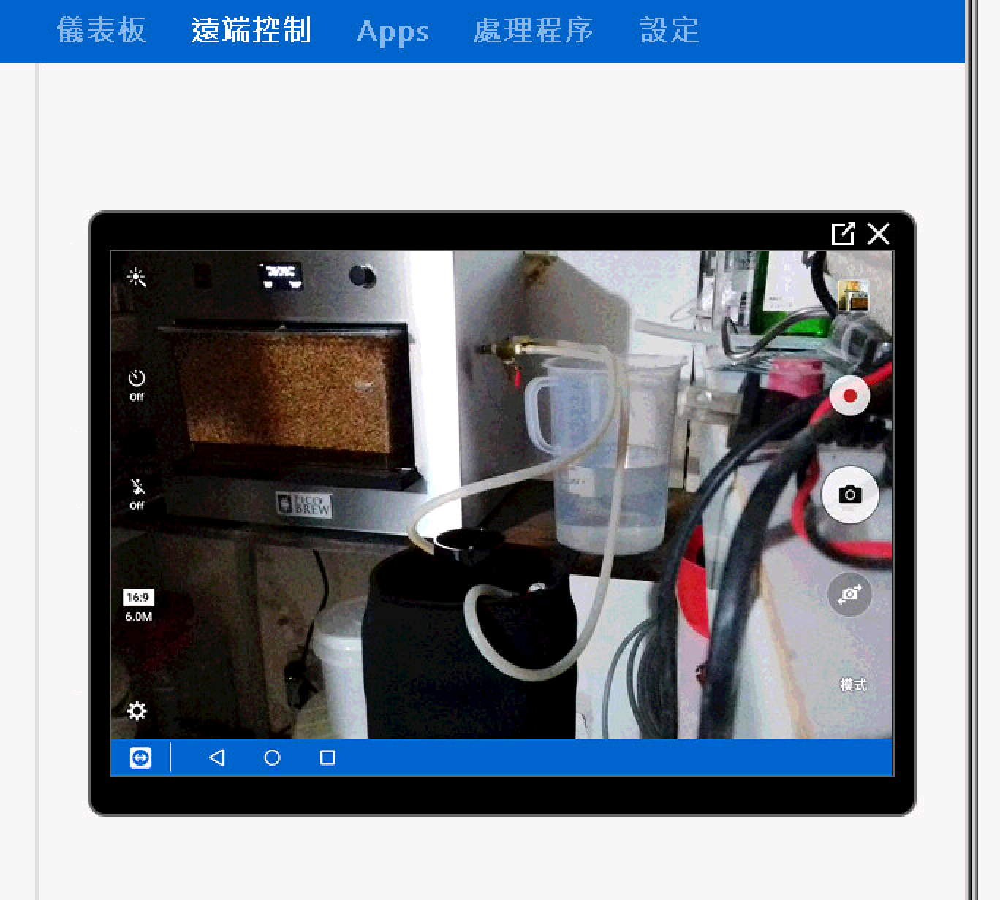

# 170425-Ethen-CreamAle

**設備**

Pico 

這批實驗

* 不立刻降溫放置數小時的苦味提升與香味散失程度
* 使用WB-06酵母於CreamAle上的效果
* 第一次無人值守運作

**麥**

* 紐西蘭pale ale 4kg

**酒花**

* 苦花：Magnum 12% 9.4g 60min
* 香花：Cascade 6% 5g 5min

**酵母**

* WB-06 從主擴培中分出約200ml加入500ml麥汁再度擴培

**流程**

糖化 67度 90min

碾麥使用一張信用卡寬

////
FG 1.054....好高啊，產量目測約15L，不知道有什麼可以量keg桶內比較準的方法..

甜度不錯，苦味略高，苦花放太多了

目標產量14L 1.0455 1.091 5.16% 19 SRM 4

產量16L OG 1.54 預估FG1.01 ABV5.71 IBU24.56 SRM4.38

正常配方

預估放置3hr的苦味提升

遠端監控

