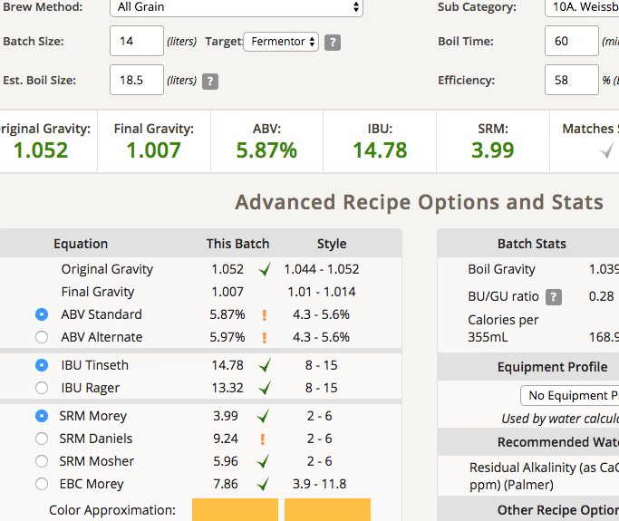

# 170425-Ethen-Fox

**設備**

Pico 

**麥**

釀酒人樂園Fox配方包

* 小麥 1.6kg
* pils 2.4kg

**酒花**

* Saaz 3.7% 12g 30min
* Hallertau 3.2% 12g 30min 
* Saaz 3.7% 13g 5min
* Hallertau 3.2% 13g 5min 

**酵母**

* WB-06 11.5g 迴旋擴培

**流程**

糖化 65度 90min

目標產量13.5L 1.0489 1.098 5.1% 13 SRM 4

OG 1.052 18kg=> 14~13.5L

糖化效率56~58%, 讚！

預估FG1.007 ABV5.88 IBU15.52 SRM4.09

