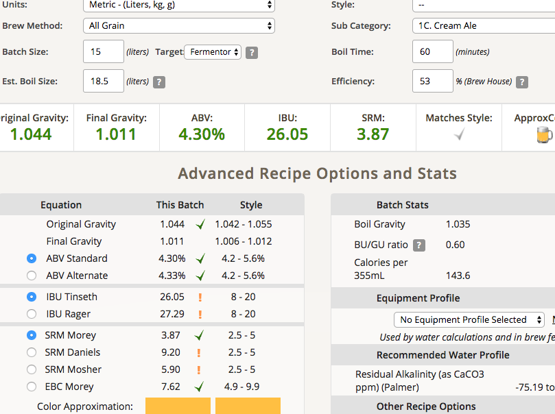

# 170514-Ethen-CreamAle

本次測試Pils在Pico煮沸上是不是會有問題

**設備**

Pico 

**麥**

* 啤酒王Pils 4kg 看起來是他自己發的麥芽，品質狀況不是很好
* 碾麥一張信用卡寬，但是似乎有點問題...

**酒花**

* Centennel 8.4% 15g 60min
* Cascade 6.7% 8g 5min 

**酵母**

* S-04 6g 白麥汁喚醒

**流程**

糖化 67度 90min

目標產量14L 1.0455 1.091 5.16% 19 SRM 4

OG 1.043(上層取樣) 15L，推定糖化效率53%

預估FG1.011 ABV4.3 IBU26.05 SRM3.87

