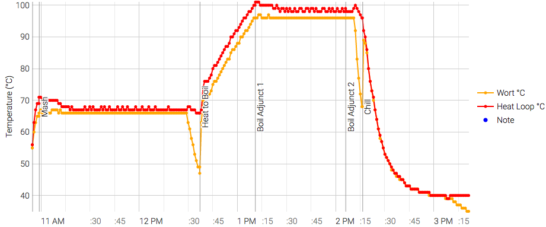

# 170616-Ethen-CreamAle

**設備**

Pico 

這批實驗

* 自動化冷卻機制
* 使用熱板冷卻法
* 無人值守運作

**麥**

* 紐西蘭pale ale 4kg

**酒花**

* 苦花：Hersbrucker 4% 27g 60min
* 香花：Cascade 7% 7g 5min

**酵母**

* S-04 約8g

常溫發酵

**流程**

16.6kg -> 12.2L左右

OG 1.06 FG 1.014 ABV 5.95 IBU 24.52 SRM 5.27

糖化效率約56%

這次測試Pico自動冷卻連動，糖化到三十分的時候產生大量泡沫導致液體無法進入麥槽，初步推估是流量不足導致的泡沫，緊急切換成桶式冷卻。過程畫面嚴重閃爍。

桶式冷卻這次的效果不錯，主桶裝到快過線就被關掉了，但降溫速度大概10分鐘降到60度，32.5分降到42度

看起來可以做定量水冷，同時溫度設定改成45度停止

2:11 96
2:17 89 (電熱關閉, chill)
2:37 46 (20min)
2:39 45
2:58 40

結果後來都拆掉跑Rinse依然畫面會閃，該不會電系真的出問題了吧

晚上本來要放棄把熱板拆掉，但測試一下意外發現In端被麥渣堵住了 = =|||, 而且估計是一開始就堵了，果然設備拿到還是應該測試一下.... 晚上測了一次流量似乎可以，明天續戰

這次醣化弄粗一點，中心還是有一點沒被沖散的，但大致上效果好多了

170628 碳酸化 1.011 2.0Vol 32度 => 67.1g

16kg=> 11.6L

桶蓋密封能力出問題，應該更換墊片試試

一樣銳利的苦味，這是不是之前提到的麥殼味，第一批pico的那個？會不會是冷卻還是不夠？

古怪的酯味... 排除這一點基本上還不錯，排除的話QAQ