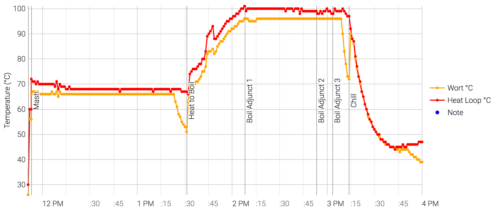

# 170618-Ethen-科隆

**設備**

Pico 

這批實驗

* 自動化冷卻機制
* 熱板冷卻法第二次測試

**水**

17.3L

**麥**

* 德國Weyermann pale ale 3.4kg
* 美國白小麥 0.4kg

醣化90min

**酒花**

* 苦花：Magnum 11.8% 10g 60min
* 香花：Hersbrucker 4.3% 12g 15min
* 香花：Hersbrucker 4.3% 10g 5min

**酵母**

* US-05 11.5g 乾酵母直下

發酵15度

**流程**

16.5kg -> 12.2L左右

OG 1.061 FG 1.012 ABV 6.45 IBU 30.7 SRM 5.01

囧，太濃了，各方面都是

糖化效率約60%, 破紀錄啦

本次操作在mash到後期還是堵住了Orz, 又是切換回桶冷卻法，因為同時講課所以沒做冷卻水循環

約20min降溫至45度，效果不錯

有人建議把熱板交換器上的ball lock接頭換掉直接接管子，下次測試

170628 碳酸化 2.0Vol 32度 => 70.6g

比重1.024實在太高了.... 喝起來一點點甜，厚度有，還不夠dry

估計殘糖為120g左右，所以直接封罐碳酸化。三天後約8psi，補足至20psi後冷藏飲用

嗯，超甜超厚，pale ale但根本不是科隆Orz