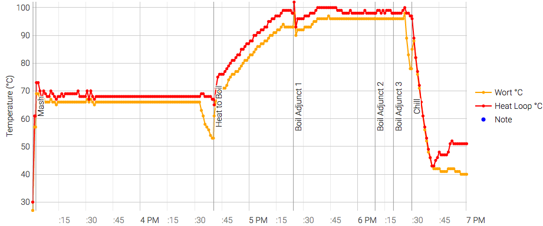

# 170619-Ethen-科隆

**設備**

Pico 

這批實驗

* 自動化冷卻機制
* 熱板冷卻法第三次測試

**水**

17.3L

**麥**

* 德國Weyermann pale ale 3.4kg
* 美國白小麥 0.4kg

醣化90min

**酒花**

* 苦花：Magnum 11.8% 10g 60min
* 香花：Hersbrucker 4.3% 12g 15min
* 香花：Hersbrucker 4.3% 10g 5min

**酵母**

* US-05 11.5g 乾酵母直下

發酵15度

**流程**

17.5kg -> 13.1L左右

補水3L

OG 1.046 FG 1.009 ABV 4.94 IBU 23.18 SRM 3.9 Match

糖化效率約66%

換成管路直通，塞住的時間延後不少，在煮沸階段才卡住。緊急更換桶子，但熱板還接在上面。更換桶子噴掉不少麥汁，這次的量應該不好看，但糖化效率彌補了一切

這次堵的位置在桶子的白頭上，但詭異的是拆開來裡面沒什麼渣。

難不成連桶子上都要改成寶塔頭直通了嗎....

熱板冷卻效率相當卓越，10分鐘降至45度，再10分鐘降到42度

170628 碳酸化 2.0Vol 32度 => 93.1g

比重1.009, 完成。氣味有點微妙，濁度遠高於高比重那桶，有點想不清楚理由

麥香味明顯，帶一點古怪的酯味，不乾爽，苦味會讓人注意到

味道有明顯的pico臭，但是喝起來還行，個人評價不及格Orz