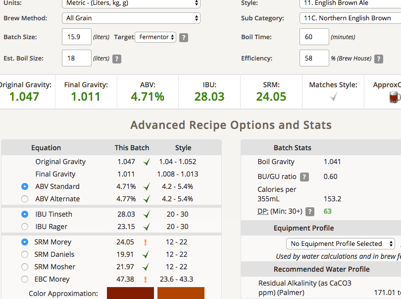
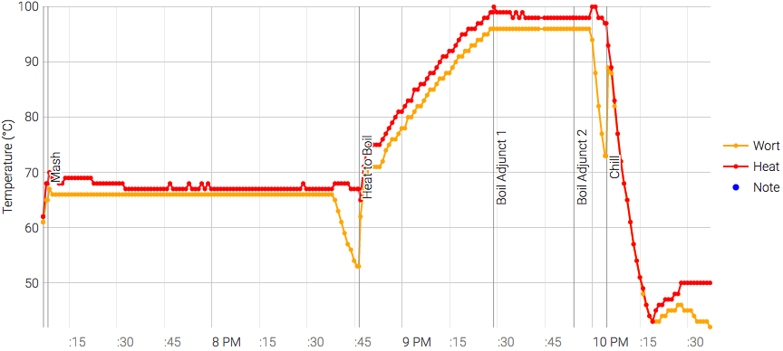

# 170718-ethen-EnglishNorthenBrown

**設備**

Pico Z with full-auto plant chiller

**麥**

* Pale ale 3600g
* Biscuit 100g
* SpecialB 100g
* Chocolate malt 100g
* Black malt 100g

total 4kg

**酒花**

* Chinook 12% 15g 30min（調降至規格）
* EK Golding 4.8% 25g 5min

**酵母**
 
* Nottingham 11.5g 直接下

**流程**

OG1.047 FG1.011 15.9L ABV4.71 IBU 28.03 SRM24.05

有補水2.1L...這次水有多加1L, 看來以後都一次多補3L好了

這次拆掉了In兩個快拆接頭的鎖心，看起來完全by pass堵住的問題了，效果不錯。冷卻速度很快15min降到46，可以再拉長一點(改20min timeout)

一開機發現RPi跳無法存取記憶卡，重開機之後就葛屁了Orz, 目前換成RPi 3B上陣，無痛轉移

該裝冷卻水架了...搬起來好累

170626 換桶，加糖2.3 valumes碳酸化