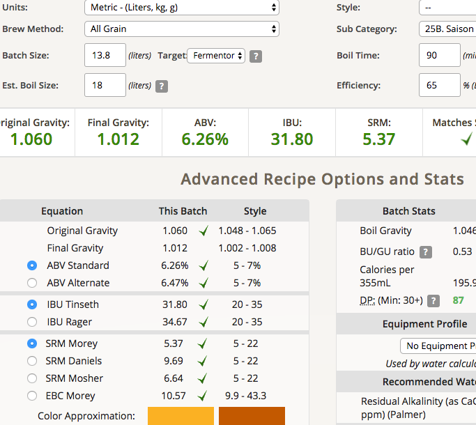
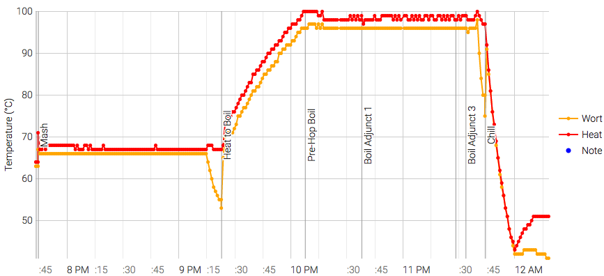

# 170720-ethen-saison

**設備**

Pico Z with full-auto plant chiller

Recipe: BW Saison

**麥**

* Pils 3100g
* Wheat 600g
* Munich 300g

total 4kg

**酒花**

* 總煮沸90min
* EK Golding 4.8% 28g 60min
* EK Golding 4.8% 14g 10min
* EK Golding 4.8% 8g 5min

**酵母**
 
* Danster Saison 11.5g 直接下

**流程**

OG1.06 FG1.012 13.8L ABV6.26 IBU 31.8 SRM5.37

18L初始水量剩下13.8L, 90min煮沸蒸發了將近4.2L

一樣拆掉了In兩個快拆接頭的鎖心，看起來完全by pass堵住的問題了，效果不錯。  

冷卻速度很快15min降到46，但設定的20min降溫似乎沒有起效果。或許該加裝一個節流閥，同時解除冷卻時間限制（30min）？  

冷卻器的水管似乎因為水壓關係有點形變，是這次買的水管太薄了嗎.....?

170625 因為趕件希望27號可以取，所以搬出至室溫加速發酵

170626 換桶，室溫觀察壓力一天後進行強制碳酸化