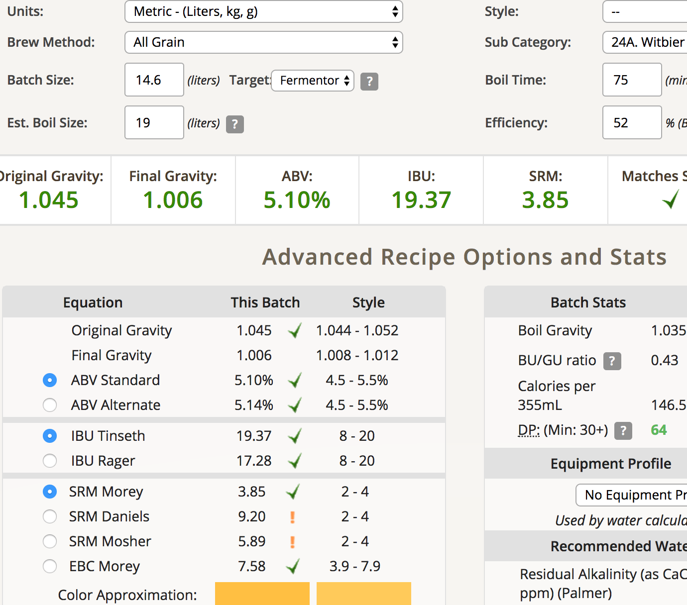
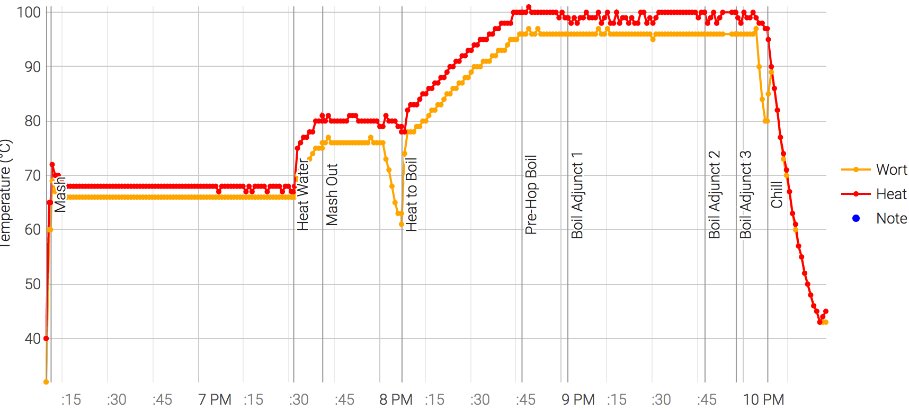

# 170720-ethen-Witbier

**設備**

Pico Z with full-auto plant chiller

Recipe: BW Witbier 

(Kronenbourg Blanc clone法國可倫堡白啤，改編自 <http://goods.ruten.com.tw/item/show?21621761803917>)

**麥**

* Pils 2100g
* Wheat malt 1500g
* Wheat 450g
* 67度80min
* 77度20min

total 4.05kg

**酒花**

* 總煮沸75min
* Mt Hood 4.8% 10g 60min
* Mt Hood 4.8% 10g 15min
* Mt Hood 4.8% 12g 5min
* Coriander 芫荽子 20g 5min （酒瓶碾碎）
* Oranger Peel 甜橙果皮 56g 5min

**酵母**
 
* Mauribrew Y-1433 11.5g 直接下

**流程**

OG1.045 FG1.006 14.6L ABV5.1 IBU19.37 SRM3.85

19L初始水量剩下14.6L, 75min煮沸蒸發了將近4.4L

板式降溫無chill_timedout，最後溫度44度左右卡住開始回升，我才注意到原來pico那個chill 10min做的事情事實上包含了啟動加熱迴路試圖加熱回指定溫度 =______=||| 中途打斷後桶子撈出來使用前面接的後段冷凝水冷卻桶子（底下桶子快滿了所以我把管子接回到上面的桶，總共接了將近100L = =）

首先可能要試著把尾段chill的10min拿掉，然後要考慮更大的洩水槽（這次把水倒回裡面去是一大失策，超難搬出來的....），也要考慮做一個魔鬼氈外套了，不能老是用桶子來避免散熱，板式冷卻器也需要外套

170626 換桶，加糖3 valumes碳酸化

170809 FG1.006 ABV5.12 很棒的丁香、芫荽子的風味，清爽又適度的香甜，忍不住一杯接一杯，個人評價相當高的一隻酒，下次一定要再多做些