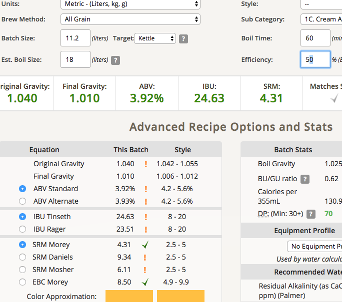
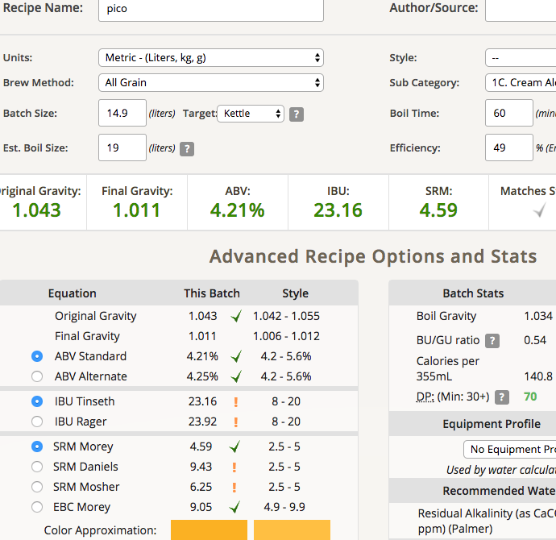
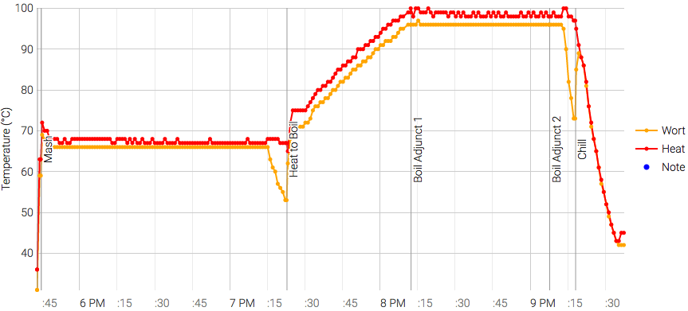

# 170723-Ethen-CreamAle

本次測試Pico與GF比較

同一隻譜(比例)、同樣原料、同樣碾麥處理、同樣發酵環境條件（keg 20度）

Pico醣化90min，剛結束Deep clean，板式冷卻

GF持續循環控溫，使用煮鍋而非GF煮沸，Keg水桶冷卻

預定成果應該會是 Pico ABV較低、苦味較高、SRM較高 同時Pico可能會有特別的味道（Pico味）

## 設備

Pico / GF同一時間各做一次

## 麥

Pico

* W麥 4kg 

GF

* W麥 2.743kg

碾麥拉得有點寬，看起來糖化效率有點太低了

## 酒花

Pico 

* Hallertau Hersbrucker 4% 27g 60min
* Cascade 6.7% 7g 5min 

GF

* Hallertau Hersbrucker 4% 20g 60min
* Cascade 6.7% 5g 5min 

## 酵母

* S-04 11.5g 1 pack

## 流程

糖化 67度 90 / 60 min

GF 15.5-4.3= 11.2L OG 1.04 50% FG 1.01 ABV 3.92 IBU 24.63 SRM 4.31

Pico 19.4-4.5=14.9L OG 1.043 49% FG 1.011 ABV 4.21 IBU 23.16 SRM 4.59  
(尾段OG1.054 62% FG 1.014 ABV 5.33 IBU 21.38 SRM 4.59) 確認必須要中途取樣，尾段比重拉高太多了

由於糖化效率只影響麥子，或許酒花該不變？

碾麥大失敗ＱＱ 不過似乎如果麥子狀況不佳，Pico與GF的效果會很接近？

### GrainFather

### PICO

