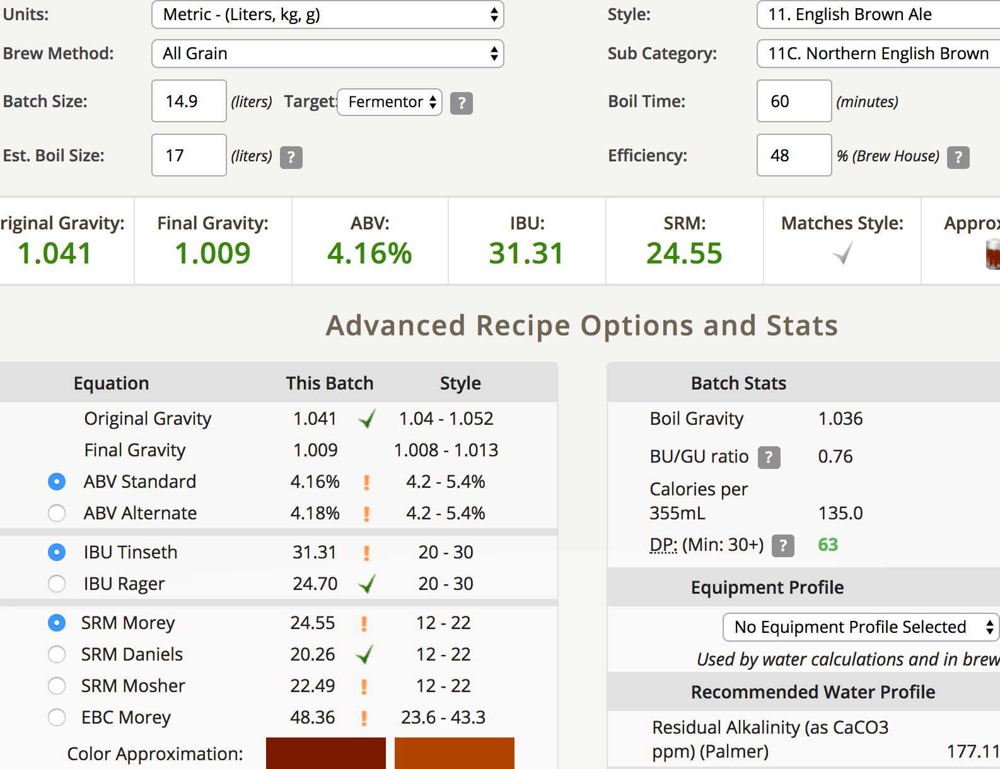
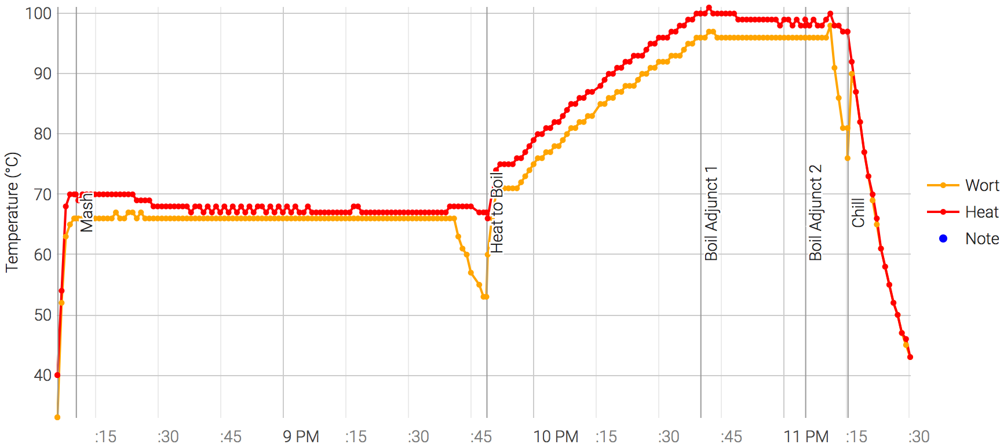

# 170725-ethen-EnglishNorthenBrown

**設備**

Pico Z with full-auto plant chiller

**麥**

* Pale ale 3600g
* Biscuit 100g
* SpecialB 100g
* Chocolate malt 100g
* Black malt 100g

total 4kg

**酒花**

* Chinook 12% 15g 30min（調降至規格）
* EK Golding 4.8% 25g 5min

**酵母**
 
* Nottingham 11.5g 直接下

**流程**

14.9L OG1.041 48% FG1.009 ABV4.16% IBU31.31 SRM24.55   
(尾段OG1.054 63% FG1.012 ABV5.46% IBU28.29 SRM24.55)

這次keg搖勻後採樣，應該是最準確的數值，可見PICO尾段殘餘了多少糖沒洗出來...

又忘記改pico hold temp設定

被酸梅湯燙到腳....

