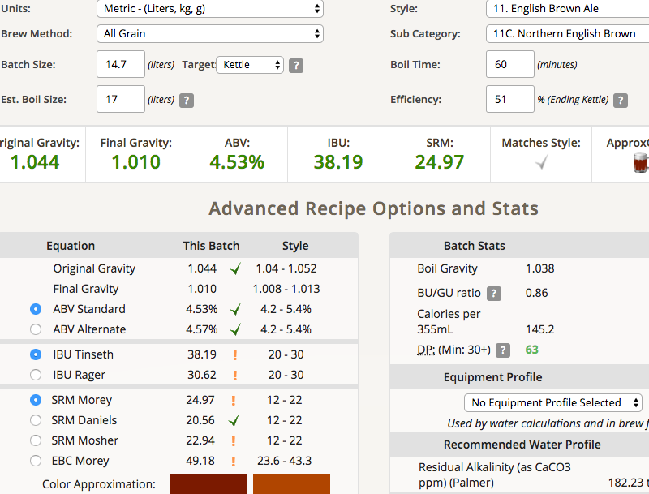
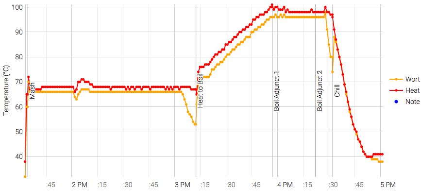

# 170729-ethen-EnglishNorthenBrown

本次測試：取消chill之後keep temp的10min

**設備**

Pico Z with full-auto plant chiller

**麥**

* Pale ale 3600g
* Biscuit 100g
* SpecialB 100g
* Chocolate malt 100g
* Black malt 100g

total 4kg

另加上之前的殘餘麥汁約1L，有確認味道正常

**酒花**

* Chinook 12% 19g 30min（清庫存多下4g，會比較接近啤酒王的譜）
* EK Golding 4.8% 25g 5min

**酵母**
 
* Nottingham 上一批的回收酵母，桶子直接使用

**流程**

19.2-4.5=14.7L

OG1.044 FG1.01 14.7L ABV4.53 IBU 38.19 SRM24.97 較苦的版本

因為使用舊酵母所以反應速度相當的快

但嚐了之前的麥汁，似乎出現了pico味，有點窘迫....擔心

颱風前開釀風太大溫度上不去，所以做了熱板的隔熱

取消chill之後keep temp的10min確實有效，套用到所有的譜上

進行deep clean

170809

FG1.007 ABV4.86 苦味銳利，Pico味隱藏其中，幹。因為特殊麥風味不夠強，這隻應該不能稱為ENB了