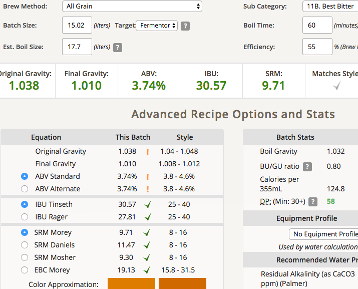
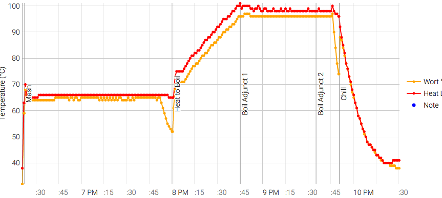

# 170730-Ethen-EnglishBitter

本次測試：MO麥芽

**設備**

Pico Z with full-auto plant chiller

**水**

17.1L

**麥**

* 英國MO pale ale 3.1kg
* crystal light 0.2kg (放一年了！)

醣化90min

**酒花**

* US Golding 4.3% 25g 60min
* US Golding 4.3% 30g 10min

**酵母**

* S-04喚醒

發酵16度

**流程**

蓋子250g 頭30g 

19.5-4.2-0.28=15.02L

OG1.038 FG1.01 ABV3.74 IBU30.57 SRM9.71 55% 

