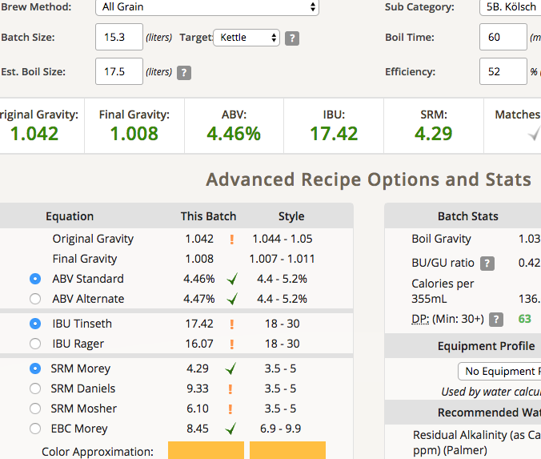
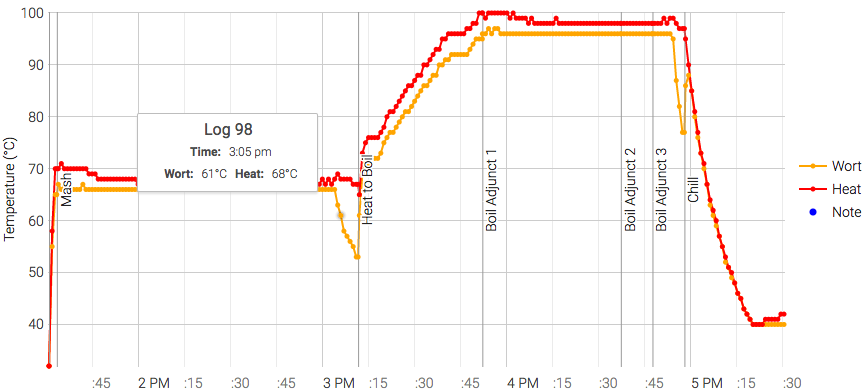

# 170730-Ethen-科隆

本次測試：洗槽、老酵母測試

洗槽效果不佳，只提升1%基本上在變異範圍內

老酵母是已經擴培後放置約一個月的US-05，一管放在間接可接受陽光的飲料櫃，另一管則放在冰箱下層

有接受紫外線照射的酵母狀況確實較差，上清液有酵母味，另一管則無特別雜味，但也有可能是酵母量較低的關係

另一方面則多少有一點點的酸味

**設備**

Pico Z with full-auto plant chiller

板式冷卻跟桶子做上隔熱了，煮沸時間約縮短了5min以上，開心

**水**

17.5L, 洗槽另加入溫水1L

**麥**

* 英國MO pale ale 3.4kg
* 美國白小麥 0.4kg

醣化90min

**酒花**

* 苦花：Magnum 11.8% 5g 60min
* 香花：Hersbrucker 4.3% 12g 15min
* 香花：Hersbrucker 4.3% 10g 5min

**酵母**

* US-05 老酵母測試 一隻4.8g酵母擴培600cc, 另一隻2.4g擴培600cc (7/3~7/30)

發酵16度

**流程**

15.3L OG1.042 FG1.008 ABV4.46% IBU17.42 SRM4.29 52% (1.049 61%)

洗槽幾乎沒反應

算錯AA, 減了Magnum結果苦味有點過低了

170809

FG 1.006 ABV 4.73% 苦味太強，Pico味強，整體來說並不討喜。值得慶幸的是酵母運作的不錯，至少證實了一個月的酵母也可以很好的工作。看來Pico的問題有點嚴重...