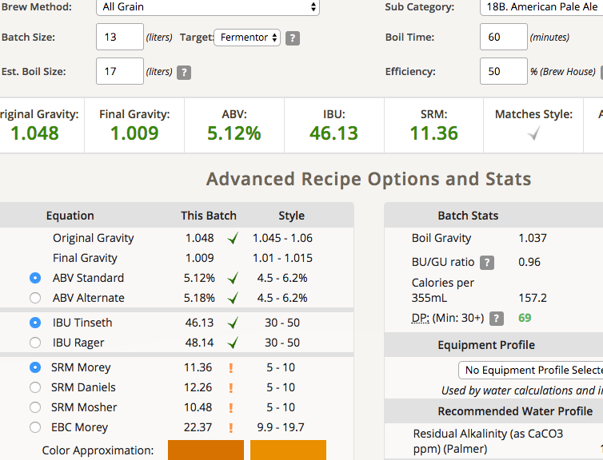
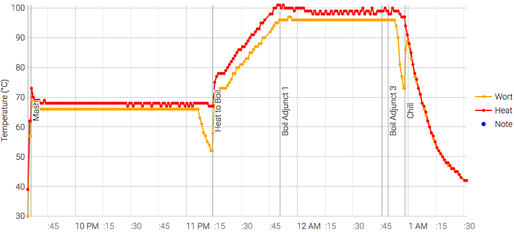

# 170731-Ethen-RayAPA

**設備**

Pico Z with full-auto plant chiller

**水**

17.1L

**麥**

* 英國MO pale ale 3kg
* Munich 0.6kg
* CaraMunich 0.3kg (原本這邊應該用水晶麥，但沒有了只好換)
* Wheat 0.1kg

醣化90min

**酒花**

* Magnum 11.8% 15g 60min
* Centennial 9.3% 7g+cascade 3g 5min
* Centennial 9.3% 20g 2min （pico無法熱泡）
* Centennial 9.3% 30g 冷泡

**酵母**

* US-05 3.4g 擴培一個月前

發酵16度

**流程**

蓋子250g 頭30g 

12.9L OG1.048 FG1.009 ABV5.12 IBU46.13 SRM11.36 50%

苦味比預期高很多啊.... 需要調整一下

170809

FG1.011 ABV4.86% 氣味顯然是APA, 但同時Pico味也很強，WTF! 不是不香，但我完全不喜歡這個味道的干擾。倒底該不該繼續乾投呢....