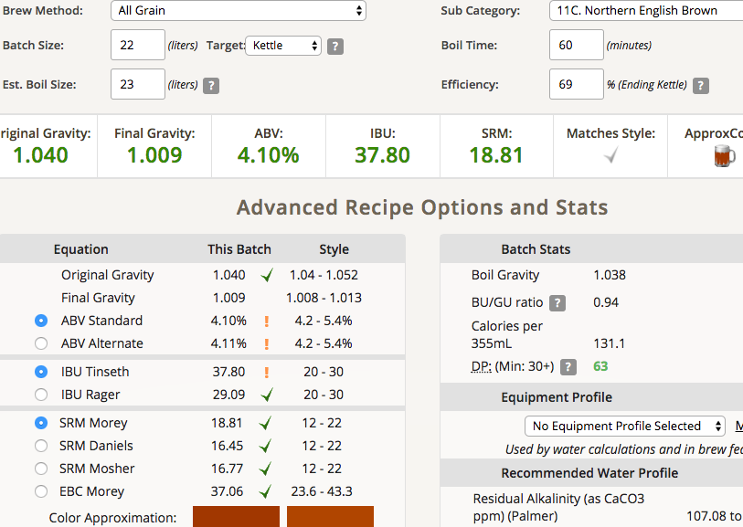

# 170912-sola-EnglishNorthenBrown

2017/9/12 天氣陰轉雨 泰利颱風在台灣旁做出神迴避

第一次嘗試Keg發酵，水加太多了⋯⋯

**設備**

GF

**麥**

啤酒王配方包

1. Pale ale malt 德國淡色麥芽   3600克  
2. Biscuit Malt   比利時餅乾麥芽   100克    
3. Chocolate Malt  比利時巧克力麥芽  100克
4. Special B Malt   比利時特別 B麥芽      100克
5. black Malt    比利時黑麥芽        100克   

其他材料

* 酒花 苦花 chinook 25g 30min
* 酒花 香花 EK Golding 25g 10min

* 酵母 Nottingham 11.5克

* 水 25公升 (理論上要留5升做洗麥，不過我恍神全下）

**流程**

糖化溫度 65度 90分鐘， 麥汁煮沸後投酒花苦花煮30分，最後10分鐘再加入香花煮。

裝進keg桶後水浴降溫，用多餘麥汁降溫後喚醒酵母約15分，再加入keg桶內。

製作完成約22公升麥汁。

OG 1.040 （好低啊）

預定成果 FG 1.009 ABV4.1 IBU37.8 SRM18.81

發酵溫度 10度 預估2週後轉桶碳酸化

操作時間從下午4點開始煮，整個收拾完大概到10點...看來還是要把操作再熟練點。

這次有種麥碾太細的感覺，不知道是不是錯覺，在取麥汁時的確底下沈澱雜質相當多。

麥汁感覺好稀，多的塞不進keg桶的拿去煮牛肉，味道還不錯。

170928

轉桶碳酸化，產量14L，FG 1.006

預定碳酸化程度：2.0Vol