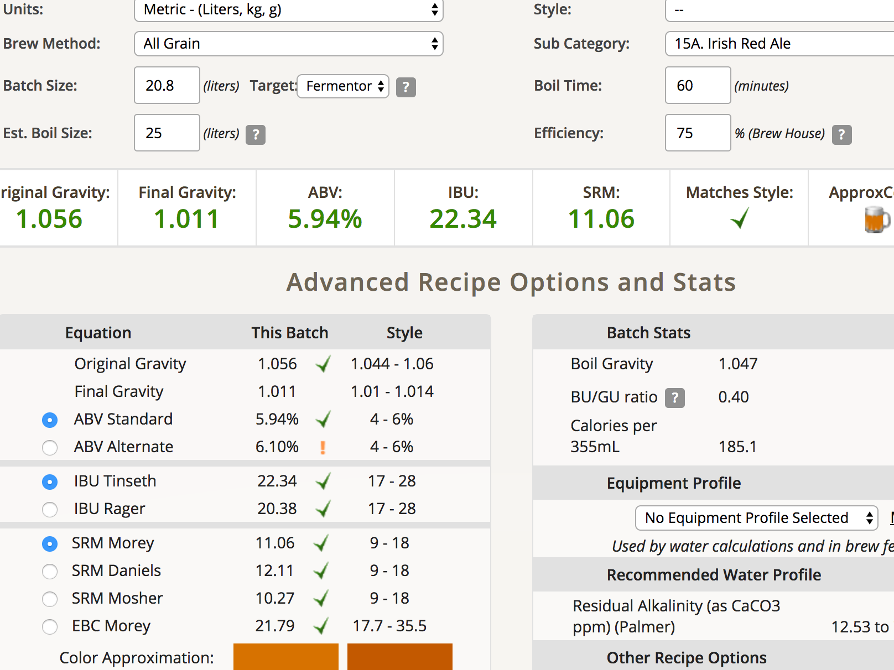
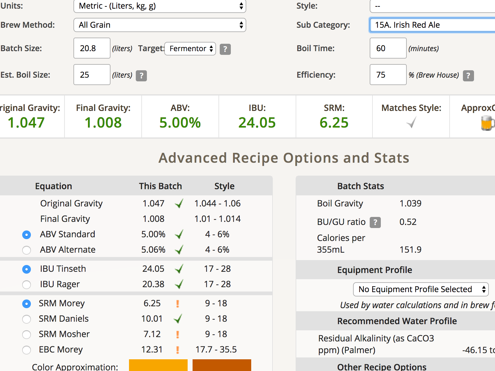

# 170xxx-ethen-AnigiRedAle

還沒做，找時間來試

Anigi: 這個水量對GF來說很麻煩，一定要調整

## 舊譜
**麥**

* Red X 2.5kg
* Dark Wheat 2.5kg
* 水 25L不洗槽

**酒花**

* Tettnanger 56g

流程

* FWH 600cc 20g 15min加入
* 28g 40min
* 8g 10min

**酵母**

* US-05 兩週

**Mash**

* 52 10min 蛋白質超高，一定要蛋白休止
* 68 60min
* 74 10min

## 新譜
Anigi: 想把Red X的個性壓低，但是變成四不像，不建議

**麥**

* pilsner 0.8kg
* wheat 2.1kg
* cara pils 0.1kg
* Red X 1.2kg

**酒花**

* Tettnanger 56g

流程

* FWH 600cc 20g 15min加入
* 28g 40min
* 8g 10min

**酵母**

* US-05 兩週

**Mash**

* 52 10min 蛋白質超高，一定要蛋白休止
* 67 60min
* 74 10min

OG 1.056  FG 1.014

