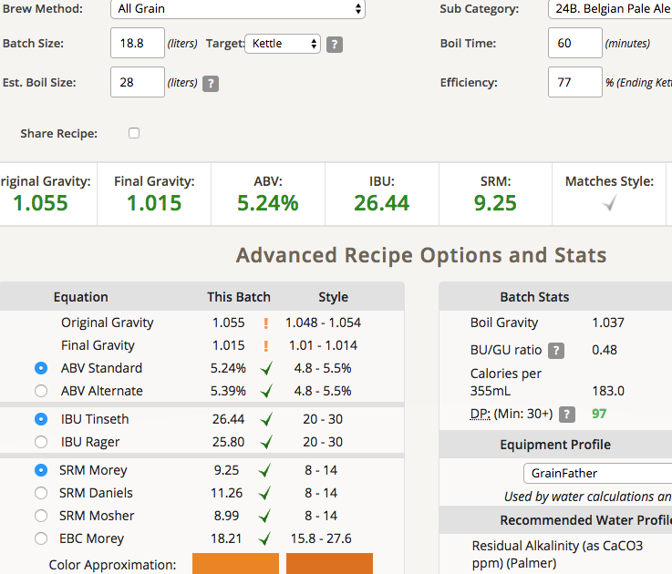

# 171108-ethen-BelgianPaleAle

12月的自釀聚會的小競賽，使用雷大的譜

**設備**

GrainFather

**麥**

這次麥子有點可惜不夠好，Pils是啤酒王之前賣的我的澳洲二稜

* Pils 3800g
* Biscuit 200g
* Caramel munich(原譜是60L) 200g
* SpecialB 100g

65度醣化80min，稍微拉長了一點。譜上說要67度但看到已經來不及了

這次碾麥發現滾輪鬆了有不少麥子沒碾到，所以又重複碾了一次，好像意外的觸發了什麼效果，糖化效率特好（當然也不能忘了前面聖誕啤酒的洗糖水）

為了加速所以試著用5L的水煮沸預定去對冷水，結果忘記了在96度的熱水的情況下下了麥芽，緊急加入冷水去覆蓋麥芽祈禱不會太慘，看起來有效w

糖化效率77%太高了點...下次可以實驗看看碾兩次的效果（尼大有講還沒看）

**酒花**

* US Golding(原EKG) 4.3% 32g 60min (多放了一點去均衡)
* Saaz 3.7% 20g 15min

煮沸大滾，蒸發量不少補了6L的水

冷卻階段因為趕場吃飯，所以初步冷卻之後放新的冷水一桶就丟下去了

**酵母**
 
* S-33 比利時乾酵母一包

約21度投入

**流程**

意外的是很精準的一批，而且產量好大

keg水位好高，感覺會大噴發（抖抖），先拿臉盆進去放了

最終產量 18.8L 糖化效率77% OAO!

OG1.055 FG1.015 ABV5.24 IBU26.44 SRM9.25 

## 171121 裝瓶

FG 1.014 芭樂般的香甜氣息，甜美可口入口不錯，帶點桀傲不遜的刺激感，需要熟成
