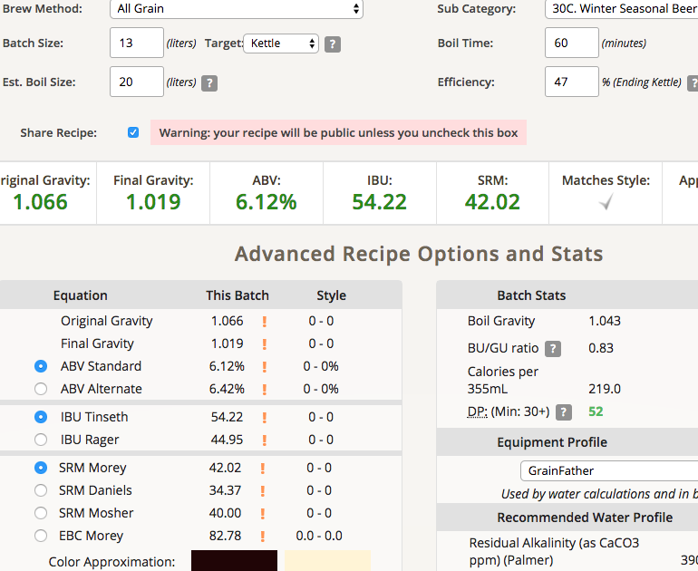

# 171108-ethen-Christmas

承諾給JC的酒，雖然他很喜歡但是我真的不記得怎麼重現這隻了...到底會做出啥呢...

**設備**

GrainFather

**麥**

麥還是找啤酒王配，畢竟本來是他的譜

* Pils 3000g
* Munich 1500g
* Caramel Aroma 750g
* Extra Dark 750g

67度醣化90min左右吧...?

這次碾麥發現啤酒王的麥芽顆粒大小不一，所以得碾細一點才有辦法涵蓋到夠量的麥，下次還是用一張信用卡寬吧....

這次想說用3.3的麥水比，結果算出來是20L的水...所以就沒的洗糖了，洗糖水拿去補後面的比利時...

糖化效率47%太低了點，下次調整碾麥的粗細應該會有改善

**酒花**

* Hallertau 4.3% 25g 60min
* Chinook 12.3% 25g 15min

煮沸大滾，蒸發量不少有略微補水

**酵母**
 
* T-58 2g擴培24hr 600cc(三包)

約24度投入

**流程**

好久沒這樣釀了

最終產量 13L 糖化效率47% QAQ

OG1.066 FG1.019 ABV6.12 IBU54.22 SRM42.02 

是說麥子型號沒對到所以找了最近的，估計有錯...

## 171121 裝瓶

FG 1.02 陳放的果乾香氣，帶著一點酒精的氣味。入口厚重但略有刺激，酵母的風味強烈，但整體來說不算太過強烈。需要熟成，適合佐餐。感覺慢慢地理解T-58的氣味了

桶底用折射量比重顯示FG 1.367....還是得另外倒一點出來量比較準

## 後記

酵母風味強烈，得到滿高的評價