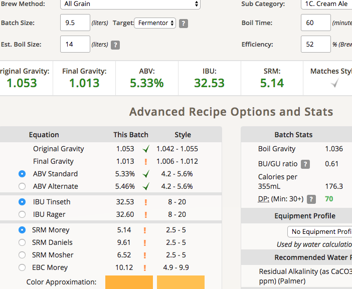
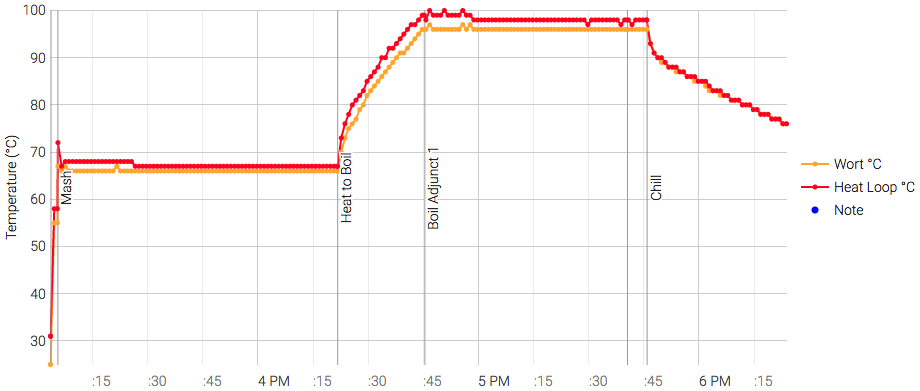

# 171108-ethen-CreamAle

本次測試：強化清潔之後的Pico是否可以排除異常風味，實驗看起來不太樂觀

即便經過兩次高強度的Deep clean, 依然有殘留異味

意外：壓克力箱體出現裂紋且漏水，WTF

糖化效率52%, 靠北都漏掉了不少怎麼可以糖化效率比之前還高...

**設備**

Pico Z 手動

**麥**

* BEST Pale ale 3000g

67度75min強制跳煮花

**酒花**

* Hallertau 4.3% 18g 60min
* Cascade 6% 5g 5min

這次沒收到感測訊號所以錯過了，多跑了30min錯過了降溫時機，苦味應該略微提高

**酵母**
 
* S-04 2g擴培24hr 600cc(三包)

約24度投入

這次over pitch了，一投入麥汁就迅速反應

**流程**

兩個月前進行過一次Deep clean + 20L的Rinse，然後跑了一趟空機CreamAle(不裝載任何麥芽酒花，10L的清水)，出來的液體是淡綠色的清水，有一點味道。

放置三個月之後，桶內有明顯沈澱與絲帶狀漂浮，蓋子內部有黑色物體黏著看起來像高泡期的沾黏（可刷掉），看來已經經過相當程度的生態循環了。這顯示做一次Deep Clean不足以洗乾淨Pico機器內部的殘餘

本次使用前再進行三次Rinse後，用PBW建議最大值（1加侖水/3ounces PBW）重新Deep Clean, 鹼性接近11. 清潔後出現大量的殘渣，液體也變為綠色。清潔到最後煮沸階段的mash時發現漏水，強制終止Deep clean. 

追蹤發現漏水源於壓克力箱體在麥芽與酒花槽之間出現裂痕，雖然範圍不大但持續一滴一滴地在漏，是壓克力老化嗎？試著先用3M強力膠布貼住後，Rinse四次，開始跑Cream Ale Test，希望這麼多重的清潔可以讓味道恢復正常

運轉中發現漏水依然存在，量小了一些，考量到產量決定減少Mash的時間為75min，之後就讓他自己跑了

最終產量 9.5L 糖化效率52%

主要釀造6.5L使用S-04（擴培）

OG1.053 FG1.013 ABV5.33 IBU32.53 SRM5.14

切分3L裝於玻璃桶另外使用WB-06發酵測試小麥酵母與阿魏酸

OG1.053 FG1.007 ABV6.09 IBU32.53 SRM5.14

171114 採樣

WB-06比重1.022 上面還有浮沫顯然發酵還沒完成，可能是投入酵母量較少的關係
香蕉與丁香均衡，入口甜而濃郁，嘴巴尾段出現苦味，仔細感受依然有Pico的特性，不過削減很多

S-04 比重1.011 已經水風數天沒動作了，吃的比預期高太多了...是因為over pitch的關係嗎？  
氣味與口感有pico味，苦味，不過比起以前略微淡了一點點，看來清潔是有一點效果，但大體上作為標準Pico味是沒有問題的

裝瓶了，不過這次裝瓶各種失誤。本來想試試看不轉桶直接裝，但是加了糖水進桶子裡才想到糖水的比重較重不會均勻分散，底下有酵母泥又不好搖動，簡直@#%$^$，下次看來真要直接裝只能單瓶加糖了。

另一方面，直接使用龍頭裝瓶會遇到泡沫問題，酒體的碳酸出來會產生泡沫，只好用特低流量去裝，但這樣就不如用泡沫飛馬了...還是得弄個裝瓶管才行

171121 裝瓶

WB-06比重1.01，香氣不錯甜味很強，但喝起來Dry。Pico味不明顯（相對比起S-04）。大丙認為可能是因為甜味造成的差異
