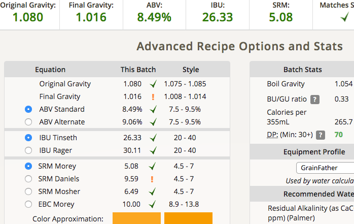

# 171120-ethen-BelgianTriple

測試濕式碾麥

**設備**

GrainFather

**麥**

* Best Malt Pale ale 5000g
* 白砂糖 1000g

手動測試碾麥機，發現即便鎖緊之後用力撥滾輪還是會滾動Orz，拿扳手鎖緊，不過滾輪也跟著被鎖死了Orz

測試濕式碾麥，麥子倒進鍋中灑水充份拌勻。比一張信用卡細，好難碾，阻力大幅增加，感覺還是得把固定架做起來不然太晃很難用

然後碾完之後還是又跑掉了....

檢視碾過的麥，麥殼完整且麥心有碎，覺得應該不錯了，

麥水比1:3 15L，醣化64度80min，一開始攪拌之後就用循環處理。

運作沒有堵，但糖化效率還是不太好，粉狀有點多不知道是不是醣化不順利

糖化時間略為拉長處理別的事情

一番搾比重1.053糖化效率約46%

煮花階段才投入白砂

包含洗糖最終糖化效率56%

**酒花**

* Hallertau 5.6% 26g 60min (調整IBU至22.9)
* Saaz 3.7% 15g 15min

冷卻過慢，本來想說要直接進入上一個發酵桶就跑去轉桶，然後才突然想起來應該先冷卻所以才去冷卻，大概多熱了20分鐘以上

**酵母**
 
* S-33 使用先前Belgian Pale Ale的舊酵母

幹了蠢事，先把舊酵母倒出來到消毒的瓶子，想讓他冷降一下丟去冷凍庫，然後就忘記了幾個小時.... 發現到的時候已經變成冰沙了囧，未結冰部分倒進麥汁並期待他還活著，幸好真的活著而且活性還不錯

約24度投入，結果冰箱又降過頭，早上起來看到14度，丟去水桶拉回17度

**流程**

最終產量 16.1L 糖化效率56% ... 不知道該說是好還是不好Orz 想說這次碾麥都這麼廢力，但畢竟是高比重好像低糖化效率也是應該的

麥汁：很甜。

OG1.08 FG1.016 ABV8.49 IBU26.33 SRM5.08 

## 171128 換桶

SG 1.012等等這不科學.... 因為底泥太多了所以換了一堆泥過去，等冷降之後可能要再換一次