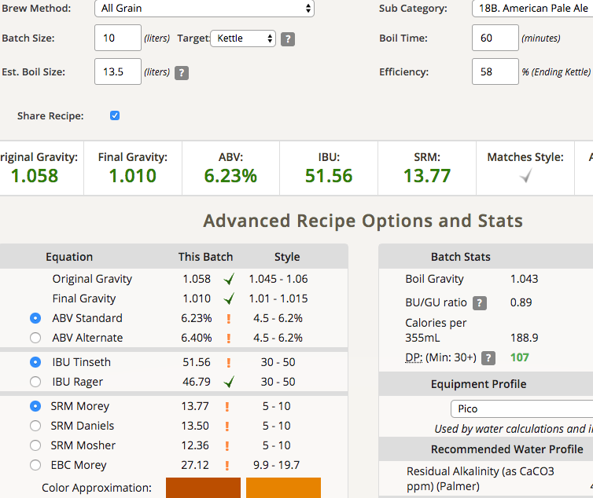
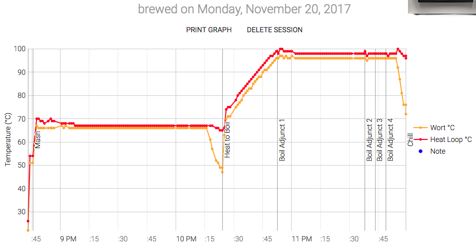

# 171120-ethen-PicoPaleAle

與大丙兄進行交錯測試機器差異

使用前再度進行Deep clean 86g/4L

**設備**

Pico Zymatic

**麥**

* American 2 Row Pale Ale 2.91kg
* American Crystal 60L 0.34kg

檢視他的麥子，麥殼完整麥心有碎塊，可以說是很完美的狀態

**酒花**

* Magnum 13.5% 6g 60min
* Perle 8.9% 11g 15min
* Cascade 6.2% 10g 10min
* Cascade 6.2% 31g 5min

Pico附的酒花狀況不是很好，失真空嚴重、沒冷藏保存、聞起來有起司味

**酵母**
 
* US-05 一包

約24度投入，結果冰箱又降過頭，早上起來看到14度，丟去水桶拉回17度

**流程**

根據計算，Brewers Friend的IBU會比Pico預期的高上不少。有些時候真不知道該看哪邊的算數.... 這玩意又無法驗證，還是只能憑感覺嗎...

最終產量 10L 糖化效率58% 這效率大爆走啊，也沒有出現結塊現象，果然還是得強化一下碾麥嗎

很甜的麥茶香，一點奶味，苦味強烈。感覺清潔有效，這次麥汁感覺舒適很多，辛辣刺激的苦味沒有之前那麼強烈。不過比重是不是過高了？

OG1.058 FG1.01 ABV6.23 IBU51.56 SRM13.77

## 171128 換桶

比重1.012，可能還可以發酵一下。有鮮明的Pico味（維他命Ｃ的氣味、鮮明的苦味）.....